# 資料分析過程

+ 此為期中(4/28)與期末(6/16)的分析整合版
+ 期中以前主要為利用coreNLP做斷詞及NER、使用ti-idf作為指標進行情緒分析
+ 期末為社會網路分析、LDA主題分析與Word2Vector等相關應用分析

- - -

# 期中動機和分析目的

美國總統大選將至，最受矚目的莫過於各州初選及辯論會的激戰。 </br>
這次的分析主要是針對民主黨的8位候選人，藉由Reddit和Twitter上的文章發表、評論等，觀察網路上的話題趨勢、對不同候選人的討論熱度以及大眾的情緒變化。我們好奇分析後的結果是否能驗證辯論會、初選的走勢。

- - -

# 期中資料集介紹

## 資料來源

+ Twitter
    + 使用Python的twitterscraper套件
    + 該套件用beautifulsoup去爬整個頁面，沒有經過tweet的api所以不用辦token，也無過去7天的限制。
    + 缺點：只會爬特定幾個區域伺服器下的tweets，造成某些日期(如：2/19)就只有2筆資料的問題。
+ Reddit Comment
    + 使用PRAW: The Python Reddit API Wrapper在subreddit="politics"進行爬蟲，搜尋關鍵字分別為八位候選人&Democratic Primary。
    + 因留言比數過多，故只抓前五頁的留言。
    + 沒有時間、筆數限制。

## 資料筆數

+ Twitter: 5232筆
    + 時間：2020/01/02-2020/03/31
+ Reddit Comment：2,230,127筆
    + 時間：2019/09/22-2020/04/08
    + Pete Buttigieg：245,520筆
    + Joe Biden：245,024筆
    + Bernie Sanders：248,741筆
    + Michael Bloomberg：244,524筆
    + Andrew Yang：244,032筆
    + Democratic Primary：234,612筆
    + Elizabeth Warren：243,540筆
    + Tulsi Gabbard：222,460筆
    + Amy Klobuchar：150,960筆

篩選後使用資料：

+ Twitter：
    + tw：Raw Data，共3694筆。
    + tokens：164,220筆
    + sentiment：5220筆
+ Reddit Comment：
    + reddit_single_person：只提到一次候選人的留言，共115,623筆。
    + reddit_comment_tokens：70,710筆
    + reddit_comment_sentiment：3150筆

## 變數介紹

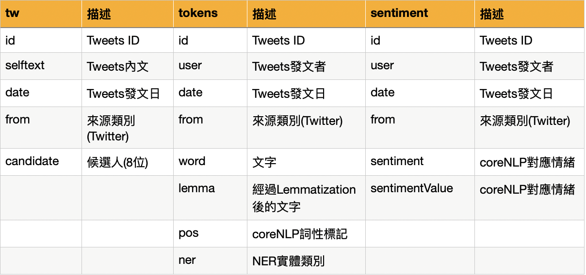{width=550px}

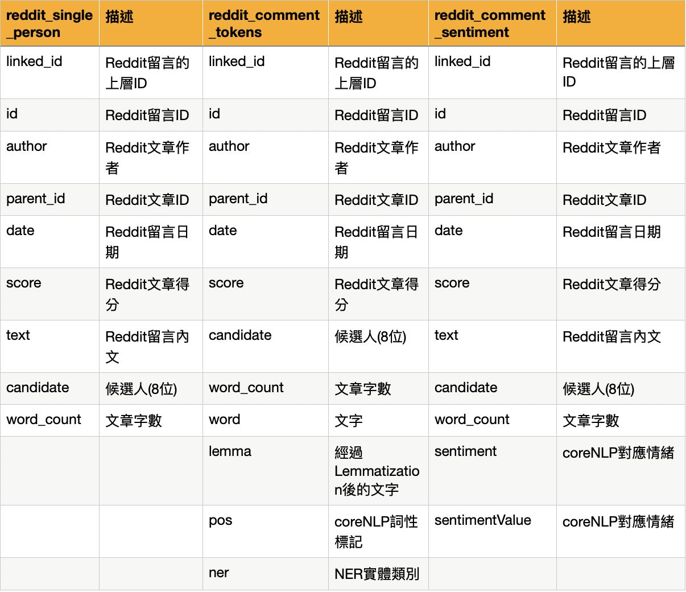{width=550px}


- - -


# 期中資料前處理

+ 準備套件
+ 讀取資料
    + 定義用於資料清理的Function
    + 使用coreNLP進行Lemmatization，解析POS/NER/Sentiment
    + 整理資料
    + 斷詞/斷句
    + 停用字/自訂辭典(候選人姓名)


## 準備套件

```{r message=FALSE, warning=FALSE}
pacman::p_load("tidyverse", "data.table", "plotly" ,"xml2", "httr", "jsonlite", "NLP", "igraph", "sentimentr", "tidytext", "d3heatmap", "tidyr", "scales", "wordcloud", "lubridate", "textdata", "ggraph")
load("asset/all_rmd_data.rdata")
# load("fin_data_tweets.rdata")
# load("reddit_coreNLP.RData")
# rm(list = ls()[!(ls() %in% c('tw','tokens','sentiment','reddit_comment','reddit_comment_partial'))])
```


## 資料清理

### 定義用於資料清理的Function

```{r eval=F}
# 一次讀取多個檔案
fun <- function(t){
  files <- list.files(path = t, pattern = "*.csv",recursive = TRUE) #檔案路徑
  df1 <- data.frame()
  for(file in files) {
    tmp<- fread(paste(t, file, sep="")) #讀進檔案
    l = list(df1,tmp)
    df1=rbindlist(l, use.names=TRUE, fill=TRUE)
  }
  return(df1)
}

# 資料清理
clean = function(txt) {
  txt = iconv(txt, "latin1", "ASCII", sub="") #轉換字符編碼
  txt = gsub("(@|#)\\w+", "", txt) #去除@或#後有數字,字母,底線 (標記人名或hashtag)
  txt = gsub("(http|https)://.*", "", txt) #去除網址
  txt = gsub("[ \t]{2,}", "", txt) #去除兩個以上空格或tab
  txt = gsub("\\n"," ",txt) #去除換行
  txt = gsub("\\s+"," ",txt) #去除一個或多個空格
  txt = gsub("^\\s+|\\s+$","",txt) #去除前後一個或多個空格
  txt = gsub("&.*;","",txt) #去除html特殊字元編碼
  txt = gsub("[^a-zA-Z0-9?!. ']","",txt) #除了字母,數字 ?!. ,空白的都去掉
  txt }
```

### 定義coreNLP用的Function


#### 串接CoreNLP API

server端 :

+ 需先在terminal開啟corenlp server
+ 在corenlp的路徑下開啟terminal輸入 `java -mx4g -cp "*" edu.stanford.nlp.pipeline.StanfordCoreNLPServer -port 9000 -timeout 15000`

```{r eval=FALSE}
# 生產core-nlp的api url，可以設定斷詞依據、以及要標註的任務
generate_API_url <- function(host, port="9000",
                    tokenize.whitespace="false", annotators=""){ #斷詞依據不是空格
    url <- sprintf('http://%s:%s/?properties={"tokenize.whitespace":"%s","annotators":"%s"}',
                     host, port, tokenize.whitespace, annotators)
    url <- URLencode(url)
}
generate_API_url("127.0.0.1")
```

```{r eval=FALSE}
# 呼叫core-nlp api
call_coreNLP <- function(server_host, text, host="localhost", language="eng",
                    tokenize.whitespace="true", ssplit.eolonly="true", annotators=c("tokenize","ssplit","pos","lemma","ner","parse","sentiment")){
  # 假設有兩個core-nlp server、一個負責英文（使用9000 port）、另一個則負責中文（使用9001 port）
  port <- ifelse(language=="eng", 9000, 9001);
  # 產生api網址
  url <- generate_API_url(server_host, port=port,
                    tokenize.whitespace=tokenize.whitespace, annotators=paste0(annotators, collapse = ','))
  
  result <- POST(url, body = text, encode = "json")
  doc <- httr::content(result, "parsed","application/json",encoding = "UTF-8")
  return (doc)
}
```

```{r eval=FALSE}
host = "127.0.0.1"
coreNLP <- function(data,host){
  # 依序將每個文件丟進core-nlp進行處理，每份文件的回傳結果為json格式
  # 在R中使用objects來儲存處理結果
  result <- apply(data, 1 , function(x){
    #object <- call_coreNLP(host, x['text'])
    object <- tryCatch({
        output <- call_coreNLP(host, x['text'])
    }, error = function(e) {
      print("error occur here")
      print(x['text'])
    })
    
    list(doc=object, data=x)
  })
  
  return(result)
}
```

#### 取得coreNLP回傳的物件
```{r eval=FALSE}
gc() # 釋放不使用的記憶體

t0 = Sys.time()
obj = data %>% filter(text != "") %>% coreNLP(host) # twitter文章
obj2  = reddit_date_sampling %>% filter(text != "") %>% coreNLP(host) #comments
# 丟入coreNLP的物件 必須符合: 是一個data.frame 有一個text欄位
Sys.time() - t0 # 執行時間
# Time difference of 14 mins

# save.image("tweets_coreNLP.RData")
```

#### 整理斷詞出結果並輸出為tokens
```{r eval=F}
coreNLP_tokens_parser <- function(coreNLP_objects){
  
  result <- do.call(rbind, lapply(coreNLP_objects, function(obj){
    original_data <- obj$data
    doc <- obj$doc
    # for a sentences
    sentences <- doc$sentences
   
    sen <- sentences[[1]]
    
    tokens <- do.call(rbind, lapply(sen$tokens, function(x){
      result <- data.frame(word=x$word, lemma=x$lemma, pos=x$pos, ner=x$ner)
      result
    }))
    
    tokens <- original_data %>%
      t() %>% 
      data.frame() %>% 
      select(-text) %>% 
      slice(rep(1:n(), each = nrow(tokens))) %>% 
      bind_cols(tokens)
    
    tokens
  }))
  return(result)
}
```

#### 整理出語句情緒並輸出為sentiment
```{r eval=F}
coreNLP_sentiment_parser <- function(coreNLP_objects){
  result <- do.call(rbind, lapply(coreNLP_objects, function(obj){
    original_data <- obj$data
    doc <- obj$doc
    # for a sentences
    sentences <- doc$sentences
    sen <- sentences[[1]]
    
    sentiment <- original_data %>%
      t() %>% 
      data.frame() %>% 
      bind_cols(data.frame(sentiment=sen$sentiment, sentimentValue=sen$sentimentValue))
  
    sentiment
  }))
  return(result)
}
```

## 讀取Twitter資料

+ tw：原始資料
+ tokens：經過coreNLP後的Twitter資料
+ sentiment：經過coreNLP後的Twitter資料
```{r eval=F}
# raw data
tw <- fread('./tweets.csv') %>% #讀進檔案
  mutate(from = "tweets") %>% #新增欄位分類
  select(screen_name, text, timestamp, from)
names(tw)[1] = "id" 
names(tw)[2] = "selftext"
names(tw)[3] = "date"
tw$date=as.Date(tw$date)
tw<-tw%>%filter(selftext!="")
tw$selftext = clean(tw$selftext)
# nlp tokens
tokens =  coreNLP_tokens_parser(obj) # 164,220
# nlp sentiment
sentiment =  coreNLP_sentiment_parser(obj) # 5220
```

```{r}
tw %>% 
  count(date) %>% 
  ggplot(aes(x=date, y=n)) + 
  geom_line() + 
  scale_x_date(labels = date_format("%Y/%m/%d")) + 
  ggtitle("每天留言數量") + 
  theme(text = element_text(family = "蘋方-繁 中黑體")) #加入中文字型設定，避免中文字顯示錯誤。
```


### 新增候選人欄位
```{r message=FALSE, warning=FALSE, eval=F}
# tw
tw$candidate <- ifelse(grepl("Andrew",tw$selftext, ignore.case = T),"Andrew Yang",
              ifelse(grepl("Yang",tw$selftext, ignore.case = T),"Andrew Yang",
              ifelse(grepl("Michael",tw$selftext, ignore.case = T),"Michael Bloomberg",
              ifelse(grepl("Bloomberg",tw$selftext, ignore.case = T),"Michael Bloomberg",
              ifelse(grepl("Joe",tw$selftext, ignore.case = T),"Joe Biden",
              ifelse(grepl("Biden",tw$selftext, ignore.case = T),"Joe Biden",
              ifelse(grepl("Bernie",tw$selftext, ignore.case = T),"Bernie Sanders",
              ifelse(grepl("Sanders",tw$selftext, ignore.case = T),"Bernie Sanders",
              ifelse(grepl("Elizabeth",tw$selftext, ignore.case = T),"Elizabeth Warren",
              ifelse(grepl("Warren",tw$selftext, ignore.case = T),"Elizabeth Warren",
              ifelse(grepl("Amy",tw$selftext, ignore.case = T),"Amy Klobuchar",
              ifelse(grepl("Klobuchar",tw$selftext, ignore.case = T),"Amy Klobuchar",
              ifelse(grepl("Pete",tw$selftext, ignore.case = T),"Pete Buttigieg",
              ifelse(grepl("Buttigieg",tw$selftext, ignore.case = T),"Pete Buttigieg",
              ifelse(grepl("Tulsi",tw$selftext, ignore.case = T),"Tulsi Gabbard",
              ifelse(grepl("Gabbard",tw$selftext, ignore.case = T),"Tulsi Gabbard",
                     "Others"
                     ))))))))))))))))
tw <- tw %>% filter(candidate!="Others")

# sentiment
tweets_partial <- sentiment
tweets_partial$candidate<-ifelse(grepl("Andrew",tweets_partial$text, ignore.case = T),"Andrew Yang",
              ifelse(grepl("Yang",tweets_partial$text, ignore.case = T),"Andrew Yang",
              ifelse(grepl("Michael",tweets_partial$text, ignore.case = T),"Michael Bloomberg",
                     ifelse(grepl("Bloomberg",tweets_partial$text, ignore.case = T),"Michael Bloomberg",
              ifelse(grepl("Biden",tweets_partial$text, ignore.case = T),"Joe Biden",
              ifelse(grepl("Joe",tweets_partial$text, ignore.case = T),"Joe Biden",
              ifelse(grepl("Bernie",tweets_partial$text, ignore.case = T),"Bernie Sanders",
              ifelse(grepl("Sanders",tweets_partial$text, ignore.case = T),"Bernie Sanders",
              ifelse(grepl("Warren",tweets_partial$text, ignore.case = T),"Elizabeth Warren",
              ifelse(grepl("Klobuchar",tweets_partial$text, ignore.case = T),"Amy Klobuchar",
              ifelse(grepl("Gabbard",tweets_partial$text, ignore.case = T),"Tulsi Gabbard",
              ifelse(grepl("Buttigieg",tweets_partial$text, ignore.case = T),"Pete Buttigieg",
              ifelse(grepl("Tulsi",tweets_partial$text, ignore.case = T),"Tulsi Gabbard",

                     "Others"
                     )))))))))))))
tweets_sentiment_candidate <- tweets_partial%>%filter(candidate!="Others")
```

### 型態轉換
```{r message=FALSE, warning=FALSE, eval=F}
# 轉回character
tokens = as.tibble(tokens) %>% mutate_if(is.factor,as.character) 
# 轉日期
tokens$date = as.Date(tokens$date, "%Y-%m-%d")
```

### 停用字與自訂辭典
```{r message=FALSE, warning=FALSE, eval=F}
# stopword
tokens$lemma = gsub("[0-9!?.]*", "", tokens$lemma)
data(stop_words) 
tokens_stop = tokens %>% 
  unnest_tokens(word, lemma) %>%
  anti_join(stop_words)

# 自訂辭典(候選人姓名)
pattern = c("^pete|^buttigieg$", "^joe|^biden$",
            "^bernie|^sanders$", "^michael|^bloomberg$",
            "^andrew|^yang$",  "^elizabeth|^warren$",
            "^tulsi|^gabbard$", "^amy|^klobuchar$",
            "^democratic|^primary$",
            "^trump|^donald$", "^hillary|^clinton$")

name = c("pete buttigieg", "joe biden",
         "bernie sanders", "michael bloomberg",
         "andrew yang", "elizabeth warren",
         "tulsi gabbard", "amy klobuchar",
         "democratic primary", 
         "trump donald", "hillary clinton")

for (i in 1:length(name)){
    tokens_stop$word = gsub(pattern[i], name[i], tokens_stop$word)
  }
```


## 讀取Reddit Comment資料

### 篩選到Twitter一致的時間範圍

+ reddit_comment_partial：取時間從2020年開始的資料，共454,672筆。
```{r eval=F}
# 載入各個候選人的comments
reddit_comment<-fun("./reddit/politics_comments/")
# 資料清理
reddit_comment<-reddit_comment[!duplicated(reddit_comment),]%>%filter(body!=""&body!="[刪除]")
reddit_comment$link_id <- substr(reddit_comment$link_id, start = 4, stop = length(reddit_comment$link_id)) #修改id
reddit_comment$parent_id <- substr(reddit_comment$parent_id, start = 4, stop = length(reddit_comment$parent_id)) #修改id
names(reddit_comment)[6] = "date"
names(reddit_comment)[9]="text"
reddit_comment$text = clean(reddit_comment$text)
reddit_comment=reddit_comment[,c(1:9)]
reddit_comment$date=as.Date(reddit_comment$date,"%m-%d-%Y") # raw data刪掉duplicate
# 篩選與Twitter一致的時間範圍
reddit_comment_partial<-reddit_comment[reddit_comment$date>="2020-01-01",] # 2020開始
```

### 挑選只提到1次候選人的留言

+ reddit_single_person：只提到一次候選人的留言，共115,623筆。
```{r message=FALSE, warning=FALSE, eval=F}
reddit_comment_partial$Bernie<-ifelse(grepl("Bernie",reddit_comment_partial$text, ignore.case = T),1,ifelse(grepl("Sanders",reddit_comment_partial$text, ignore.case = T),1,0))

reddit_comment_partial$Andrew<-ifelse(grepl("Andrew",reddit_comment_partial$text, ignore.case = T),1,ifelse(grepl("Yang",reddit_comment_partial$text, ignore.case = T),1,0))

reddit_comment_partial$Biden<-ifelse(grepl("Joe",reddit_comment_partial$text, ignore.case = T),1,ifelse(grepl("Biden",reddit_comment_partial$text, ignore.case = T),1,0))

reddit_comment_partial$Bloomberg<-ifelse(grepl("Michael",reddit_comment_partial$text, ignore.case = T),1,ifelse(grepl("Bloomberg",reddit_comment_partial$text, ignore.case = T),1,0))

reddit_comment_partial$Buttigieg<-ifelse(grepl("Pete",reddit_comment_partial$text, ignore.case = T),1,ifelse(grepl("Buttigieg",reddit_comment_partial$text, ignore.case = T),1,0))

reddit_comment_partial$Amy<-ifelse(grepl("Amy",reddit_comment_partial$text, ignore.case = T),1,ifelse(grepl("Klobuchar",reddit_comment_partial$text, ignore.case = T),1,0))

reddit_comment_partial$Warren<-ifelse(grepl("Elizabeth",reddit_comment_partial$text, ignore.case = T),1,ifelse(grepl("Warren",reddit_comment_partial$text, ignore.case = T),1,0))

reddit_comment_partial$Gabbard<-ifelse(grepl("Tulsi",reddit_comment_partial$text, ignore.case = T),1,ifelse(grepl("Gabbard",reddit_comment_partial$text, ignore.case = T),1,0))

reddit_comment_partial$sum<-rowSums(reddit_comment_partial[,c("Bernie","Andrew","Bloomberg","Biden","Amy","Warren","Gabbard")])

reddit_single_person <- reddit_comment_partial%>%filter(sum==1)
reddit_single_person <- reddit_single_person[,1:9]
```

```{r}
reddit_single_person %>% 
  count(date) %>% 
  ggplot(aes(x=date, y=n)) + 
  geom_line() + 
  scale_x_date(labels = date_format("%Y/%m/%d")) + 
  ggtitle("每天留言數量") + 
  theme(text = element_text(family = "蘋方-繁 中黑體")) #加入中文字型設定，避免中文字顯示錯誤。
```

### 新增候選人欄位
```{r message=FALSE, warning=FALSE, eval=F}
reddit_single_involved$candidate<-ifelse(grepl("Andrew",reddit_single_involved$text, ignore.case = T),"Andrew Yang",
              ifelse(grepl("Yang",reddit_single_involved$text, ignore.case = T),"Andrew Yang",
              ifelse(grepl("Michael",reddit_single_involved$text, ignore.case = T),"Michael Bloomberg",
                     ifelse(grepl("Bloomberg",reddit_single_involved$text, ignore.case = T),"Michael Bloomberg",
              ifelse(grepl("Joe",reddit_single_involved$text, ignore.case = T),"Joe Biden",
              ifelse(grepl("Biden",reddit_single_involved$text, ignore.case = T),"Joe Biden",
              ifelse(grepl("Bernie",reddit_single_involved$text, ignore.case = T),"Bernie Sanders",
              ifelse(grepl("Sanders",reddit_single_involved$text, ignore.case = T),"Bernie Sanders",
              ifelse(grepl("Elizabeth",reddit_single_involved$text, ignore.case = T),"Elizabeth Warren",
              ifelse(grepl("Warren",reddit_single_involved$text, ignore.case = T),"Elizabeth Warren",
               ifelse(grepl("Amy",reddit_single_involved$text, ignore.case = T),"Amy Klobuchar",       
              ifelse(grepl("Klobuchar",reddit_single_involved$text, ignore.case = T),"Amy Klobuchar",
              
              ifelse(grepl("Pete",reddit_single_involved$text, ignore.case = T),"Pete Buttigieg",
              ifelse(grepl("Buttigieg",reddit_single_involved$text, ignore.case = T),"Pete Buttigieg",
              ifelse(grepl("Tulsi",reddit_single_involved$text, ignore.case = T),"Tulsi Gabbard",
              ifelse(grepl("Gabbard",reddit_single_involved$text, ignore.case = T),"Tulsi Gabbard",
                     "Others"
                     ))))))))))))))))
```

### coreNLP

+ 用字數剔除一些資料，並配合不同的焦點篩選資料
+ 因為Reddit Comment資料量太大，我們會選擇篩選字數小於100的資料，並用亂數挑選的方式來呈現較長時期的現象，取到資料量與twitter資料差不多等級的筆數，針對有興趣的事件或候選人再將其範圍縮小取後，即可取得單位時間較多且較多元的資料。

```{r message=FALSE, warning=FALSE, eval=F}
# 生成一個欄位叫word_count儲存text的字數
reddit_single_person$word_count = str_count(reddit_single_person$text, "\\w+")

reddit_single_person %>% 
  filter(word_count < 200) %>% 
  group_by(word_count) %>% 
  summarise(count = n()) %>% 
  ggplot(aes(x=word_count, y=count)) + 
  geom_line() +
  ggtitle("字數分佈") + 
  theme(text = element_text(family = "蘋方-繁 中黑體")) #加入中文字型設定，避免中文字顯示錯誤。
```

```{r message=FALSE, warning=FALSE, eval=F}
reddit_date_sampling <- reddit_single_person %>% 
  filter(word_count <= 50) %>% 
  group_by(date) %>% 
  sample_n(30)

# nlp tokens
reddit_comment_tokens =  coreNLP_tokens_parser(obj2) # 70710 obs
# nlp sentiment
reddit_comment_tokens =  coreNLP_tokens_parser(obj2) # 3150 obs
```

### 型態轉換
```{r message=FALSE, warning=FALSE, eval=F}
# 轉回character
reddit_comment_tokens = as.tibble(reddit_comment_tokens) %>% mutate_if(is.factor,as.character) 
# 轉日期
reddit_comment_tokens$date = as.Date(reddit_comment_tokens$date, "%Y-%m-%d")
```

### 停用字與自訂辭典
```{r message=FALSE, warning=FALSE, eval=F}
reddit_comment_tokens$lemma = gsub("[0-9!?.]*", "", reddit_comment_tokens$lemma)
# stopword
reddit_comment_tokens_stop = reddit_comment_tokens %>% 
  unnest_tokens(word, lemma) %>%
  anti_join(stop_words)

# 自訂辭典(候選人姓名)
pattern = c("^pete|^buttigieg$", "^joe|^biden$",
            "^bernie|^sanders$", "^michael|^bloomberg$",
            "^andrew|^yang$",  "^elizabeth|^warren$",
            "^tulsi|^gabbard$", "^amy|^klobuchar$",
            "^democratic|^primary$",
            "^trump|^donald$", "^hillary|^clinton$")

name = c("pete buttigieg", "joe biden",
         "bernie sanders", "michael bloomberg",
         "andrew yang", "elizabeth warren",
         "tulsi gabbard", "amy klobuchar",
         "democratic primary", 
         "trump donald", "hillary clinton")

for (i in 1:length(name)){
    reddit_comment_tokens_stop$word = gsub(pattern[i], name[i], reddit_comment_tokens_stop$word)
  }
```


- - -


以視覺化方式呈現：

+ 文字雲
+ 初選特定事件分析
+ 情緒分析
    + Afinn字典
    + coreNLP
+ Bernie Sanders、Elizabeth Warren、Joe Biden分析


# NER分析
```{r}
# 辨識出哪幾種類型的實體
levels(as.factor(tokens$ner))
levels(as.factor(reddit_comment_tokens_stop$ner))
# 除去Entity為Other，有多少種word有被標註entity
length(unique(tokens$word[tokens$ner != "O"])) # 3290
length(unique(reddit_comment_tokens_stop$word[reddit_comment_tokens_stop$ner != "O"])) # 773
```

## 人物NER

+ 談論民主黨初選議題，所涉及的人物
```{r message=FALSE, warning=FALSE}
x = c("PERSON","COUNTRY","IDEOLOGY")

wf = function(x){ tokens_stop %>%
  filter(ner == x) %>%  #篩選NER為COUNTRY
  count(word) %>%
  mutate(from = "Twitter",
         freq = n/sum(n),
         word = reorder(word, freq)) %>% 
  rbind(
    reddit_comment_tokens_stop %>%
    filter(ner == x) %>%  #COUNTRY
    count(word) %>%
    mutate(from = "Reddit",
           freq = n/sum(n),
           word = reorder(word, freq))
) %>% 
  top_n(15, wt=freq) %>% 
  ggplot(aes(word, freq, fill = from)) + 
  geom_col(position="dodge",show.legend = F)+
  ggtitle(paste0("Word Frequency (NER is ",x,")")) +
  theme(text=element_text(size=14))+
  coord_flip() -> p
ggplotly(p)
}

wf(x[1])
```


## 國家NER

+ 談論民主黨初選議題，所涉及的國家
```{r}
wf(x[2])
```


## 思想NER

+ 談論民主黨初選議題，所涉及的國家
```{r}
wf(x[3])
```


# 初選特別事件分析

民主黨初選各州的投票日期皆不同，從2/3開始到6/6結束。以下將挑具有熱門話題的事件，切時間點(主要為2月~3月的事件)去觀察他們對選情的影響。

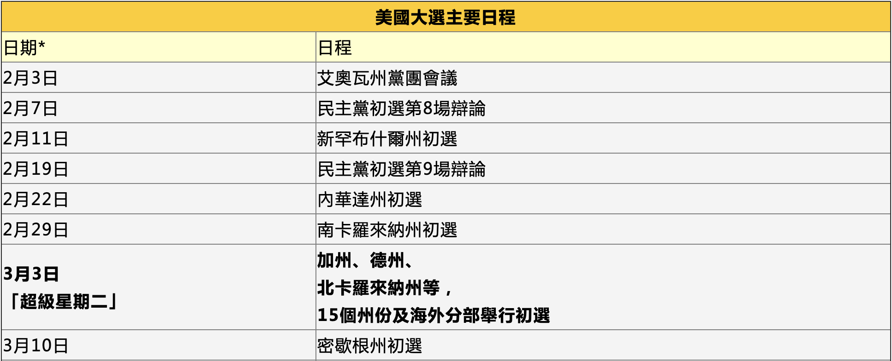


## 民主黨第9次電視辯論會（2/19）

+ 2/21 美國有線電視新聞網（CNN）的政治評論員在星期四晚上張貼了一張手機圖片，手機背面的標籤上寫著“Yang2024”。美國風險投資公司創始人的支持者（其中許多人仍然在主要投票中讚成楊）對這則推文做出了積極反應。
+ 2/19 Sanders在民意調查中處於領先地位，biden位居第二。
```{r message=FALSE, warning=FALSE}
event = function(x, title=1, min_date, max_date, event_date){
  title = ifelse(title==1, "Twitter", "Reddit")
  x %>% filter(date > min_date & date < max_date & ner=="PERSON") %>% 
  filter(word %in% name[1:8]) %>% 
  count(date, word) %>% 
  bind_tf_idf(word, date, n) %>% 
  arrange(desc(tf)) %>% 
  ggplot(aes(date, tf, col=word)) +
  geom_line(show.legend = F) + 
  geom_point(show.legend = F) +
  geom_vline(xintercept = as.numeric(ymd(event_date)), linetype="dashed", 
                color = "gray", size=0.7) +
  ggtitle(paste0(title,"前/後一週候選人變化"))->p
ggplotly(p)
}

event(tokens_stop, 1, "2020-02-12", "2020-02-26", "2020-02-19")
event(reddit_comment_tokens_stop, 2, "2020-02-12", "2020-02-26", "2020-02-19")
```

+ 2/21 Andrew Yang的熱潮似乎只存在Twitter上，Reddit則觀察不到此現象，由此可看出hashtag引起的議題討論只限於Twitter這個平台。

## 民主黨第10次電視辯論會（2/25）

+ 2/25 Elizabeth Warren攻擊Bloomberg關於女性性別歧視的議題，描述Bloomberg的公司, Bloomberg LP前僱員Sekiko Sakai Garrison的指控。在1998年的一次訴訟中，Garrison說，當她告訴Bloomberg她懷孕時，他告訴她“殺死它”。
+ Biden對Sanders的槍枝管制提出批評
```{r}
event(tokens_stop, 1, "2020-02-18", "2020-03-03", "2020-02-25")
event(reddit_comment_tokens_stop, 2, "2020-02-18", "2020-03-03", "2020-02-25")
```

+ 從Reddit資料集可看出Bernie Sanders討論熱度一直維持在高檔，Joe Biden在進入三月後有上升的趨勢。

## 超級星期二（3/3）

+ 3/3 Bernie Sanders在超級星期二初選中被喬·拜登（Joe Biden）超越
+ 3/7 一名男子在民主黨總統候選人在亞利桑那州的一次活動中發表講話時解開納粹旗幟 。Bernie Sanders週日表示，他“從未期望他作為美國人的生活”看到納粹國旗在一次重大政治集會上揮舞。該事件引起了強烈抗議，在社交媒體上遭到了廣泛譴責，並引發了對安全的呼籲。
```{r}
event(tokens_stop, 1, "2020-02-25", "2020-03-10", "2020-03-03")
event(reddit_comment_tokens_stop, 2, "2020-02-25", "2020-03-10", "2020-03-03")
```

+ Joe Biden跟Bernie Sanders討論熱度在超級星期二後開始產生交叉。

## Warren宣布退出初選（3/5）

### 話題人物當週變化

#### Twitter

+ 從本張圖也可以看出3/3超級星期二討論度上升，且Trump和Elizabeth被討論的次數最多
+ 但我們想觀察的Warren宣布退選並沒有比較特別引起討論，Warren哭哭
```{r}
heat = function(x){
  x %>% filter(date>"2020-03-01" & date<"2020-03-07" & ner=="PERSON") %>% 
  count(date, word) %>% 
  bind_tf_idf(word, date, n) %>% 
  arrange(desc(tf_idf)) %>% 
  head(100) %>% 
  select("word","date") %>% 
  table() %>% 
  as.data.frame.matrix %>% 
  d3heatmap(F,F,col=colorRamp(c('lightyellow','red')), show_grid = F, xaxis_font_size="10pt")
}

heat(tokens_stop)
```

#### Reddit
```{r}
heat(reddit_comment_tokens_stop)
```

# 情緒分析

## AFINN字典

### Twitter

+ Bernie, Biden, Bloomberg有比較明顯的情感趨勢，令人意外的是Andrew Yang很早就退出初選，但依然維持著討論熱度，或許Twitter是Yang有優勢的平台。
```{r message=FALSE, warning=FALSE, eval=F}
tw_unnest<-tw%>%unnest_tokens(word,selftext)%>%
            filter(word!=stop_words$word)
afinn<-lexicon_afinn()
tw_afinn<-tw_unnest%>%
  inner_join(afinn)%>%
  group_by(date,candidate)%>%
  summarise(sentiment = sum(value))
```

```{r message=FALSE, warning=FALSE, fig.height=10}
ggplot(tw_afinn, aes(date, sentiment, fill = candidate)) +
  geom_col(show.legend = FALSE) +
  facet_wrap(~candidate, ncol = 2, scales = "free_x") +
  xlab("") +
  ylab("") +
  ggtitle("各候選人的情感趨勢")-> p
ggplotly(p) %>% hide_legend()
```


### Reddit Comment

+ 我們可以觀察到Bloomberg在二月中以及Biden在三月底有個dip，大致可以推測是第九次辯論會（Bloomberg第一次參加）前大家對Bloomberg撒錢買初選的批評；與Biden離勝出初選越來越勝券在握時，大家對他諸多性騷擾事件的討論。
```{r message=FALSE, warning=FALSE, eval=F}
reddit_comment_unnest<-reddit_single_person%>%unnest_tokens(word,text)%>%
            filter(word!=stop_words$word)

reddit_sentiment_afinn<-reddit_comment_unnest%>%
  inner_join(afinn)%>%
  group_by(date,candidate)%>%
  summarise(sentiment = sum(value))
```

```{r message=FALSE, warning=FALSE}
ggplot(reddit_sentiment_afinn, aes(date, sentiment, fill = candidate)) +
  geom_line(aes(colour = candidate),show.legend = F) +
  ggtitle("各候選人的情感趨勢") -> p
ggplotly(p)
```


## coreNLP情緒(Twitter)

+ 我們認為用情緒字典做出來的分析會受到字典詞彙量影響而不太精確，因此也做了coreNLP的情緒分析。
```{r}
# 語句情緒值與情緒文章的分佈
sentiment$sentiment %>% table()
reddit_comment_sentiment$sentiment %>% table()
```

### 正面文章的詞彙使用
```{r message=FALSE, warning=FALSE}
wc = sentiment %>% 
  merge(tokens) %>% 
  anti_join(stop_words) %>% 
  filter(!word %in% c('Bernie','Sanders','Bernie Sanders')) %>% 
  filter(sentiment == "Verypositive" | sentiment =='Positive') %>%
  group_by(lemma) %>% #根據word分組
  summarize(count = n())
wordcloud(wc$lemma,wc$count, 
          min.freq = 5, max.words=200, random.order=F, 
          rot.per=0.35, colors=brewer.pal(8, "Dark2"))
```

### 負面文章的詞彙使用
```{r message=FALSE, warning=FALSE}
wc = sentiment %>% 
  merge(tokens) %>% 
  anti_join(stop_words) %>% 
  filter(!word %in% c('Bernie','Sanders','Bernie Sanders')) %>% 
  filter(sentiment == "Verynegative" | sentiment =='Negative') %>%
  group_by(lemma) %>% #根據word分組
  summarize(count = n())
wordcloud(wc$lemma,wc$count, 
          min.freq = 10, max.words=200, random.order=F, 
          rot.per=0.35, colors=brewer.pal(8, "Dark2"))
```


## 特定候選人組合分析

### Bernie Sanders、Elizabeth Warren、Joe Biden分析

+ 選擇初選戰到最後的三人進行細部分析
```{r}
graph_preprocess<-function(senti_data){
  senti_data$sentimentValue = as.numeric(senti_data$sentimentValue) 
  senti_data$date = as.Date(senti_data$date)
  senti_data$text = as.character(senti_data$text)
  return(senti_data)
}
```


#### 民主黨第9次電視辯論會（2/19）
+ Bernie維持穩健，Biden, Warren呈現上升趨勢。
```{r}
load("asset/BEJ_9_debate_tokens.RData")
load("asset/BEJ_9_debate_sentiment.RData")
sentiment<-graph_preprocess(sentiment)

sentiment %>% 
 #filter(candidate == "Michael Bloomberg") %>% 
  group_by(date, candidate) %>% 
  summarise(avg_sentiment = mean(sentimentValue,na.rm=T)) %>% 
  ggplot(aes(x=date, y=avg_sentiment, colour=candidate)) + 
  geom_line()+
  geom_point(show.legend = F) +
  geom_vline(xintercept = as.numeric(as.Date("2020-03-03")), linetype="dashed", color = "gray", size=0.7)-> p
ggplotly(p)

```


#### 民主黨第10次電視辯論會（2/25）

+ Bernie依然平穩，Warren, Biden則能觀察到辯論會前後有明顯起伏
```{r}
load("asset/BEJ_10_debate_sentiment.RData")
sentiment<-graph_preprocess(sentiment)

sentiment %>% 
 #filter(candidate == "Michael Bloomberg") %>% 
  group_by(date, candidate) %>% 
  summarise(avg_sentiment = mean(sentimentValue,na.rm=T)) %>% 
  ggplot(aes(x=date, y=avg_sentiment, colour=candidate)) + 
  geom_line()+
  geom_point(show.legend = F) +
  geom_vline(xintercept = as.numeric(as.Date("2020-02-25")), linetype="dashed", color = "gray", size=0.7)-> p
ggplotly(p)
```

#### 超級星期二（3/3）

+ 可以發現到Bernie一路走來幾乎都是情緒分數幾乎都維持平穩。在超級星期二後Biden有個小上升，Warren則是呈現大幅上升，直到3/5她宣布退選為止。
+ 超級星期二Bernie慘敗，遭Biden一舉逆轉。有些Bernie支持者認為主因是Warren來分括進步派選票，民主黨四人幫則開始大力的呼籲進步派團結到Bernie之下，但Warren宣布退選當天卻拒絕宣布他將會支持誰，甚至指控Bernie放任他的支持者在網路上大肆攻擊。
```{r}
load("asset/BEJ_super_tuesday_sentiment.RData")
sentiment<-graph_preprocess(sentiment)

sentiment %>% 
  group_by(date, candidate) %>% 
  summarise(avg_sentiment = mean(sentimentValue,na.rm=T)) %>% 
  ggplot(aes(x=date, y=avg_sentiment, colour=candidate)) + 
  geom_line()+
  geom_point(show.legend = F) +
  geom_vline(xintercept = as.numeric(as.Date("2020-03-03")), linetype="dashed", color = "gray", size=0.7) + 
  geom_vline(xintercept = as.numeric(as.Date("2020-03-05")), linetype="dashed", color = "gray", size=0.7) -> p
ggplotly(p)

```


### Birnie和Warren同時出現的留言

+ 因為Bernie跟Warren票源相近且在網路上多有摩擦，因此我們好奇當Bernie跟Warren同時出現的留言會呈現出何種情緒。
```{r}
load("asset/BW_sentiment.RData")
sentiment<-graph_preprocess(sentiment)
sentiment %>% 
  group_by(date) %>% 
  summarise(avg_sentiment = mean(sentimentValue,na.rm=T)) %>% 
  ggplot(aes(x=date, y=avg_sentiment)) + 
  geom_line()-> p
ggplotly(p)
```

+ 在3/3 ~ 3/5這個區間，可以發現Negative的留言數大幅多於Positive跟Neutral，可以印證我們上面的討論。
```{r}
sentiment %>% 
  group_by(date, sentiment) %>% 
  summarise(count = n()) %>% 
  ggplot(aes(x = date, y = count, colour = sentiment)) + 
  geom_line() + 
  geom_point(show.legend = F) +
  geom_vline(xintercept = as.numeric(as.Date("2020-03-03")), linetype="dashed", color = "gray", size=0.7) + 
  geom_vline(xintercept = as.numeric(as.Date("2020-03-05")), linetype="dashed", color = "gray", size=0.7) + 
  ggtitle("Bernie & Warren 情緒-留言數") + 
  theme(text = element_text(family = "Heiti TC Light"))-> p
ggplotly(p)

```

#### Warren在超級星期二之後的負面文字雲

+ 可以看到出現support, endorse, progressive等字眼。
+ Super PAC（超級政治行動委員會）也出現在文字雲中，2010最高法院裁決認為美國企業可以不受限制地投入競選資助。
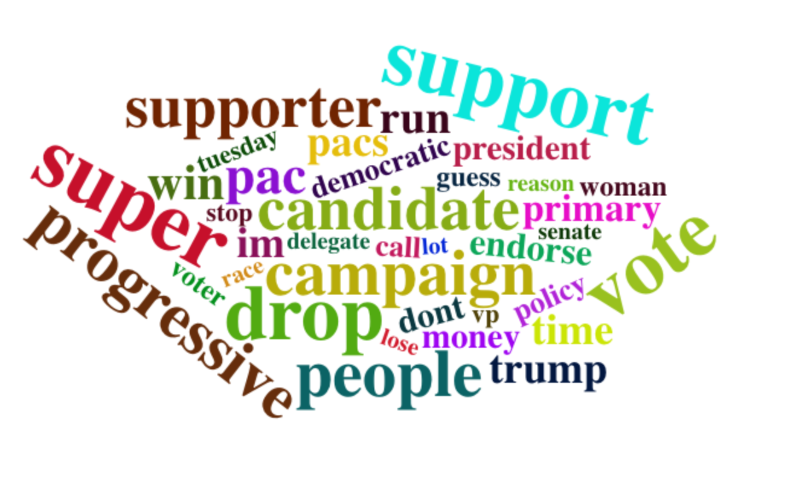{width=550px}

# 共現相關圖分析

+ 使用Reddit資料
+ Twitter筆數太少，看不出什麼洞察因此不放上來

## 2-gram
```{r message=FALSE, warning=FALSE, eval=F}
data_bigram<-reddit_single_involved%>%unnest_tokens(bigram,text,token="ngrams",n=2)
            
bigrams_seperated<-data_bigram%>%
  separate(bigram,c("word1","word2"),sep = " ")

bigrams_filtered<-bigrams_seperated%>%
  filter(!word1%in%stop_words$word)%>%
  filter(!word2%in%stop_words$word)

# new bigram counts:
bigram_counts<-bigrams_filtered%>%
  count(word1,word2,sort = TRUE)

bigrams_united<-bigrams_filtered%>%
  unite(bigram,word1,word2,sep = " ")

bigram_graph<-bigram_counts%>%
  filter(n>400)%>%
  graph_from_data_frame()
# bigram_graph

set.seed(2017)
a <- grid::arrow(type = "closed", length = unit(.15, "inches"))
```

```{r message=FALSE, warning=FALSE}
ggraph(bigram_graph, layout = "fr") +
  geom_edge_link(aes(edge_alpha = n), show.legend = FALSE,
                 arrow = a, end_cap = circle(.07, 'inches')) +
  geom_node_point(color = "lightblue", size = 5) +
  geom_node_text(aes(label = name), vjust = 1, hjust = 1) +
  theme_void()
```


## 3-gram
```{r message=FALSE, warning=FALSE, eval=F}
data_trigram<-reddit_single_involved%>%unnest_tokens(trigram,text,token="ngrams",n=3)
            
trigrams_seperated<-data_trigram%>%
  separate(trigram,c("word1","word2","word3"),sep = " ")

trigrams_filtered<-trigrams_seperated%>%
  filter(!word1%in%stop_words$word)%>%
  filter(!word2%in%stop_words$word)%>%
  filter(!word3%in%stop_words$word)

# new bigram counts:
trigram_counts<-trigrams_filtered%>%
  count(word1,word2,word3,sort = TRUE)

trigram_graph<-trigram_counts%>%
  filter(n>25)%>%
  graph_from_data_frame()
# trigram_graph
```

+ 美國的醫療保健和醫療保險大部分由私營部門（private insurance）經營人均醫療保健支出遠超過其他競爭國家，但幾乎有十分之一的美國人沒有該系統的醫療保健服務。
+ Bernie Sanders將全民醫療保險作為政策基礎，主張淘汰私人保險，轉而享受由公共資金提供的全額保險。
+ Joe Biden 沒有支持這種轉變，但他甚至致力於“公共選擇”（public option）。這樣一來，無論收入多少，任何人都可以購買現有的公共計劃，而這種計劃最終可能比私人保險便宜些。
+ 全球冠狀病毒大流行如何影響這場辯論？
    + 關鍵在於美國公眾如何看待更協調的公共資助系統在應對該病毒方面的努力。
    + 但有五分之二的美國人說，大流行使他們更有可能支持全民醫療保健，其中包括四分之一的共和黨人。
+ social safety security cutting
    + 川普政府希望從針對窮人的醫療補助，食品券和其他安全網計劃中削減數十億美元的聯邦支持
    
```{r message=FALSE, warning=FALSE}
ggraph(trigram_graph, layout = "fr") +
  geom_edge_link(aes(edge_alpha = n), show.legend = FALSE,
                 arrow = a, end_cap = circle(.07, 'inches')) +
  geom_node_point(color = "lightblue", size = 5) +
  geom_node_text(aes(label = name), vjust = 1, hjust = 1) +
  theme_void()
```


- - -

# 期中結論(4/28)

我們試著從資料分析的結果來驗證辯論會、初選的走勢，可以發現在文字雲和NER的分析裡，一些Bernie Sanders、Joe Biden、democratic primary等討論度很高的詞彙都有顯示出來。甚至是在做時事分析時，從每個候選人的詞頻圖、熱圖，也都和時事互相符合。最後我們也利用了共現圖，去觀察大眾在這段時間裡常討論的主題有哪些。 </br>
在分析的過程中，因為工具的限制所以對資料動了許多手腳。比如說，在一段評論中若提及兩個以上的候選人，我們就會將它刪除，因為我們無法判定這段評論的情緒到底是歸屬於誰。 </br>
另外，因為刪減了部分的資料而導致我們在做分析時，必須要不斷的嘗試使用不同的觀察值，來使得結果比較符合現況。因此希望在後續的課程裡，可以學習到更進階的分析方法，來幫助我們達成目標。

- - -

# 期末動機和分析目的

我們延續期中專案，這次將Twitter的資料拿掉(因為每日的資料筆數不均勻)，主要以Reddit的主文與底下的留言為分析對象，並且針對最重要的三位候選人Joe Biden、Bernie Sanders和Elizabeth Warren進行探討。<br>
上次的分析結果有驗證一些重要事件(如：超級星期二、辯論會)大致符合候選人的走勢，然而仍不夠細緻；因此本次將使用社會網路、主題分析及Word2Vec的技術，讓分析更具說服力。

- - -

# 期末資料集介紹

+ 資料來源：Reddit
+ 時間：2020/02/03-2020/04/08(期中分析後篩選此範圍)
+ 主文(Post)：共419筆觀察值，221個不重複ID
+ 留言(Comment)：328,155筆觀察值，76882則不重複留言

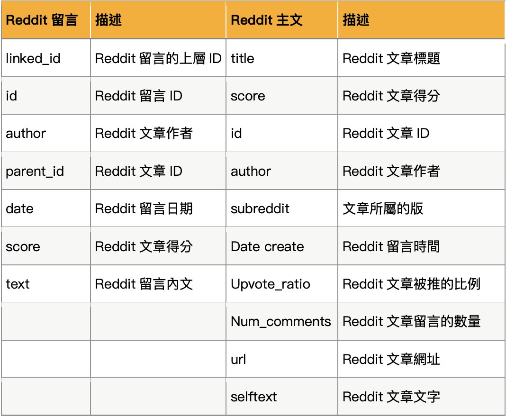{width=500px}

+ W2V變數表

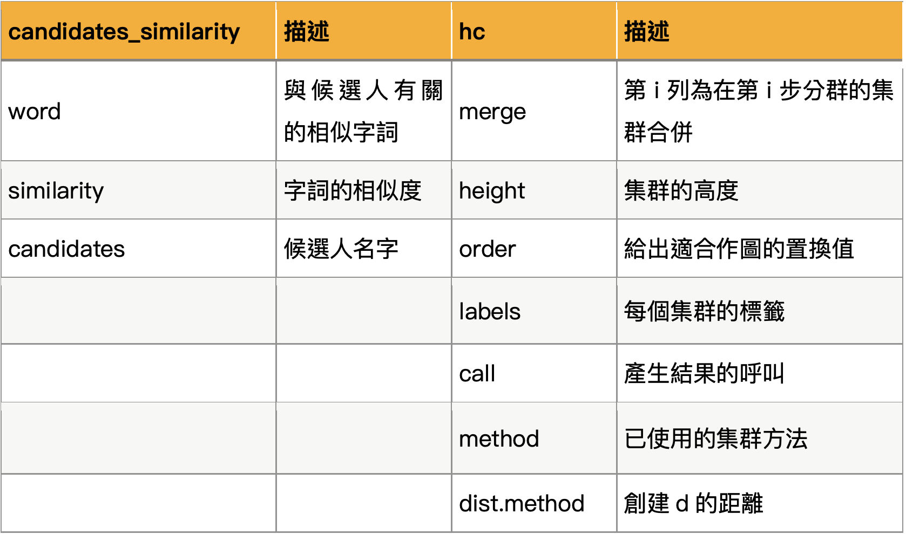{width=500px}
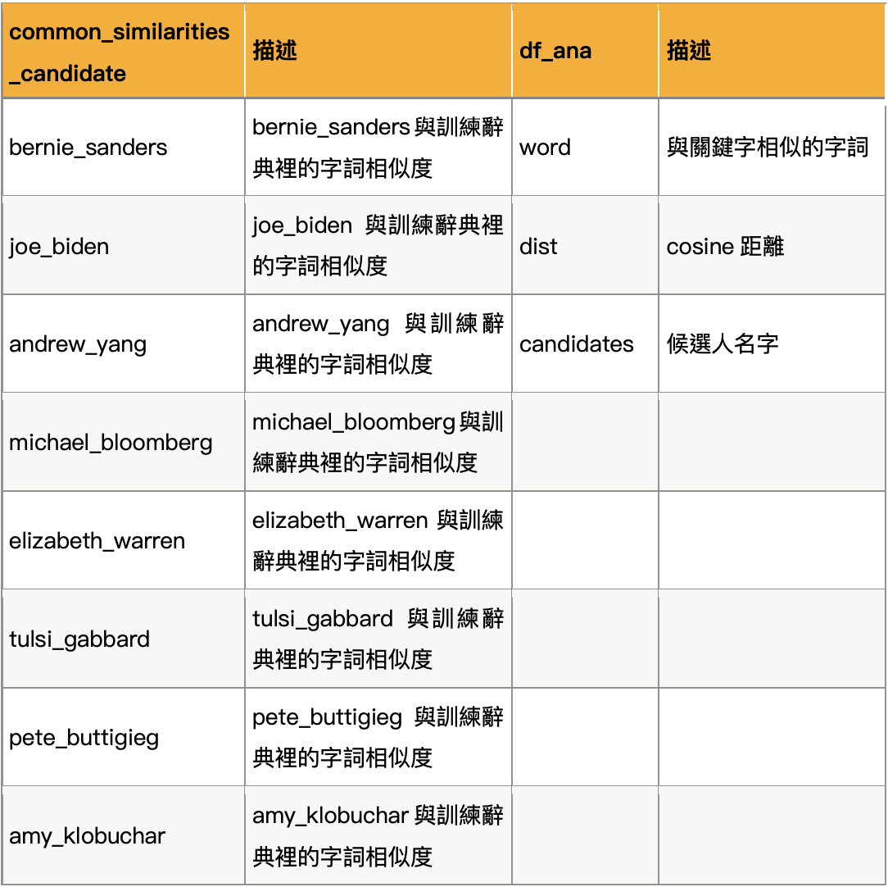{width=500px}

- - -

# 期末資料整理

## 環境設定與套件、function載入
```{r message=F, warning=F}
setwd("/Volumes/GoogleDrive/我的雲端硬碟/R/TextMining/美國初選評論/Final")
load("asset/final_data.rdata")
pacman::p_load(readr, tm, data.table, jiebaR, tidytext, tidyr, topicmodels, LDAvis, webshot, purrr, ramify, RColorBrewer, htmlwidgets,servr, wordVectors, magrittr, factoextra, FactoMineR, tidyverse, dendextend, ape, rword2vec, scales, igraph)
# devtools::install_github("mukul13/rword2vec")
mycolors <- colorRampPalette(brewer.pal(8, "Set3"))(20)
```

## Reddit主文(post)資料整理
```{r eval=F}
all_post <- fun("politics/")
yang <- fun("politics/Andrew Yang/")
bernie <- fun("politics/Bernie Sanders/")
elizabeth <- fun("politics/Elizabeth Warren/")
joe <- fun("politics/Joe Biden/")
democratic <- fun("politics/Democratic Primary/")
all_post <- rbind(bernie, elizabeth, joe)
all_post <- bernie

# 清理資料
all_post <- all_post[,2:9] # 刪除多餘欄位
names(all_post)[6] = "date"
all_post$date = as.Date(all_post$date, "%m-%d-%Y")

all_post <- all_post %>%   # 篩選日期2/3~4/8
  filter(date >= as.Date("2020-02-03") & date <= as.Date("2020-04-08"))
```


## Reddit留言(comment)資料整理
```{r eval=F}
all_comment <- fun("politics_comments/")

# 清理資料
all_comment <- all_comment[,2:9] # 刪除多餘欄位
all_comment$link_id <- substr(all_comment$link_id, start = 4,     # 修改id
                              stop = length(all_comment$link_id)) 
all_comment$parent_id <- substr(all_comment$parent_id, start = 4, # 修改id
                                stop = length(all_comment$parent_id)) 
names(all_comment)[5] = "date"
names(all_comment)[ncol(all_comment)] = "text"
all_comment$date = as.Date(all_comment$date, "%m-%d-%Y")
all_comment$text = clean(all_comment$text)

all_comment <- all_comment %>%  # 篩選日期2/3~4/8
  filter(date >= as.Date("2020-02-03") & date <= as.Date("2020-04-08"))
```

## 發文數分佈
```{r message=F, warning=F}
all_post %>% 
  group_by(date) %>% 
  summarise(count = n()) %>% 
  ggplot(aes(x=date, y=count)) + 
  geom_line() + 
  scale_x_date(labels = date_format("%Y/%m/%d")) + 
  ggtitle("每天發文數量") + 
  theme(text = element_text(family = "Heiti TC Light"))
```

## 留言數分佈
```{r message=F, warning=F}
all_comment %>% 
  group_by(date) %>% 
  summarise(count = n()) %>% 
  ggplot(aes(x=date, y=count)) + 
  geom_line() + 
  scale_x_date(labels = date_format("%Y/%m/%d")) + 
  ggtitle("每天留言數量") + 
  theme(text = element_text(family = "Heiti TC Light"))
```

```{r eval=F}
length(unique(all_post$author))
length(unique(all_comment$author))
all_user <- c(all_post$author, all_comment$author)
length(unique(all_user))
```

## 新增分析用欄位

### type: poster or replyer

+ 整理所有出現過的使用者
+ 如果他曾發過文的話就標註他爲poster
+ 如果沒有發過文的話則標註他爲replyer
```{r eval=F}
userList <- data.frame(user=unique(all_user)) %>%
              mutate(type=ifelse(user%in%all_post$author, "poster", "replyer"))
```

### parent_author
```{r eval=FALSE}
post_parent <- all_post %>% 
  #filter(num_comments >= 20) %>% 
  #filter(date == as.Date("2020/05/29")) %>% 
  select(id, author, date)
#comment_parent <- all_comment %>% 
#  select(id, author)
#parent <- rbind(post_parent, comment_parent)

names(post_parent)[1] <- "link_id"
names(post_parent)[2] <- "link_author"
names(post_parent)[3] <- "link_date"

#names(parent)[1] <- "parent_id"
#names(parent)[2] <- "parent_author"

politics <- inner_join(all_comment, post_parent, by = "link_id")
#worldnews <- inner_join(all_comment, parent, by = "parent_id")
politics <- politics %>% distinct(id, .keep_all = TRUE)
```

- - -

# 社會網路分析(SNA)

## 超級星期二(3/3)網路分析

### 資料一覽
```{r}
all_post %>% 
  filter(date == as.Date("2020/03/03")) %>% 
  #filter(num_comments <= 50000) %>% 
  count() # 19

link <- politics %>%
  filter(link_date == as.Date("2020/03/03")) %>% 
  #filter(link_date >= as.Date("2020/02/19") & link_date <= as.Date("2020/02/25")) %>% 
  filter(author != "") %>% 
  dplyr::select(author, link_author, link_id) %>% 
  #select(author, parent_author, parent_id) %>% 
  unique()
link %>% head(10)
```

### 過濾圖中的點(v)

+ 這邊要篩選link中有出現的使用者
+ 因爲如果userList（igraph中graph_from_data_frame的v參數吃的那個東西）中出現了沒有在link中出現的使用者也會被igraph畫上去，圖片就會變得沒有意義
+ 想要看會變怎麼樣的人可以跑一下這裡的code
```{r}
filtered_user <- userList %>%
  filter(user%in%link$author | user%in%link$link_author) %>%
  filter(user != "") %>% 
  #filter(user%in%link$author | user%in%link$parent_author) %>%
  arrange(desc(type))
filtered_user %>% head(10)
```

### 過濾使用者後

+ 建立網路關係圖，因爲剛剛看的時候感覺箭頭有點礙眼，所以這裡我們先把關係的方向性拿掉，減少圖片中的不必要的資訊
```{r}
set.seed(487)
reviewNetwork <- graph_from_data_frame(d=link, v=filtered_user, directed=F)
plot(reviewNetwork, vertex.size=3, edge.arrow.size=0.05,vertex.label=NA)
```

### 加強圖像的顯示資訊

+ 篩選要顯示出的使用者，以免圖形被密密麻麻的文字覆蓋
+ 顯示有超過200個關聯的使用者賬號
```{r}
set.seed(487)
labels <- degree(reviewNetwork)
V(reviewNetwork)$label <- names(labels)

V(reviewNetwork)$color <- ifelse(V(reviewNetwork)$type=="poster", "gold", "lightblue")
plot(reviewNetwork, vertex.size=3, edge.arrow.size=0.05,
     vertex.label=ifelse(degree(reviewNetwork) > 200, V(reviewNetwork)$label, NA),  vertex.label.font=2)
```

```{r eval=F}
politics %>% 
  filter(author == "shatabee4")

politics %>% 
  filter(author == "Bernie-Standards" | author == "shatabee4" | author == "Plymouth03" | author == "GhostBalloons19" | author == "") %>% 
  group_by(author) %>% 
  summarise(article = n_distinct(link_id))
```

### 篩選有影響力的意見領袖

+ 網路頂點篩選機制：
    + 分數>1或<0(被upvote或downvote次數較多)
    + 在五篇文章以上留言過
    + 一篇文章留言超過五次
```{r eval=F}
# 分數>1或<0(upvote或downvote次數較多)
link <- politics %>%
  filter(date == as.Date('2020-03-03')) %>%
  #filter(author != "") %>% 
  filter(score < 0 | score > 1) %>%
  
  #在五篇文章以上留言過
  #group_by(author) %>% 
  #filter(n_distinct(link_id) >= 5) %>% 
  #ungroup() %>% 
  
  #一篇文章留言超過五次
  #group_by(author, link_id) %>% 
  #filter(n()>5) %>% 
  #ungroup() %>% 
  select(author, link_author, id, score) %>% 
  unique()

# 篩選link中有出現的使用者
filtered_user <- userList %>%
          filter(user%in%link$author | user%in%link$link_author) %>%
          arrange(desc(type))
# 建立網路關係
reviewNetwork <- graph_from_data_frame(d=link, v=filtered_user, directed=F)

# 依據使用者身份對點進行上色
labels <- degree(reviewNetwork)
V(reviewNetwork)$label <- names(labels)
V(reviewNetwork)$color <- ifelse(V(reviewNetwork)$type=="poster", "gold", "lightblue")

# 依據回覆發生的文章所對應的主題，對他們的關聯線進行上色
E(reviewNetwork)$color <- ifelse(E(reviewNetwork)$score > 1, "lightgreen", "palevioletred")

# 畫出社群網路圖
set.seed(5432)
plot(reviewNetwork, vertex.size=2, edge.width=1, vertex.label.dist=1,
     vertex.label=ifelse(degree(reviewNetwork) >= 50, V(reviewNetwork)$label, NA),vertex.label.font=2)

# 加入標示
legend("topright", c("poster","replyer"), pch=21,
  col="#777777", pt.bg=c("gold","lightblue"), pt.cex=1, cex=1)
legend("topleft", c("upvote","downvote"), 
       col=c("lightgreen","palevioletred"), lty=1, cex=1)
legend("bottomright", c("150","197"))
#legend("bottomright", c("20","74"))
#legend("bottomright", c("30","148"))
```


### Bernie Sanders網路圖

```{r}
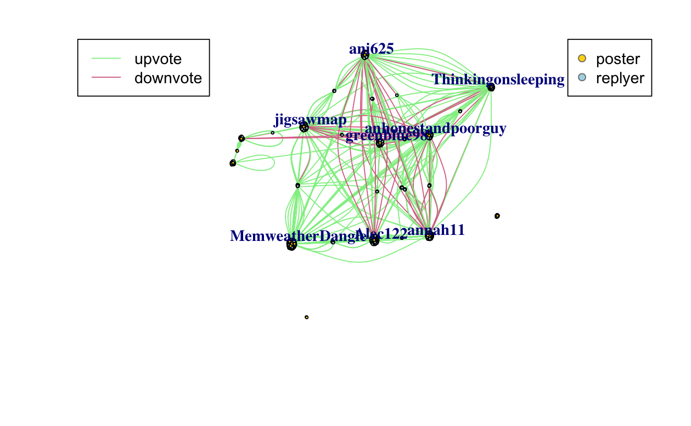
```

### Bernie Downvote分析
```{r}
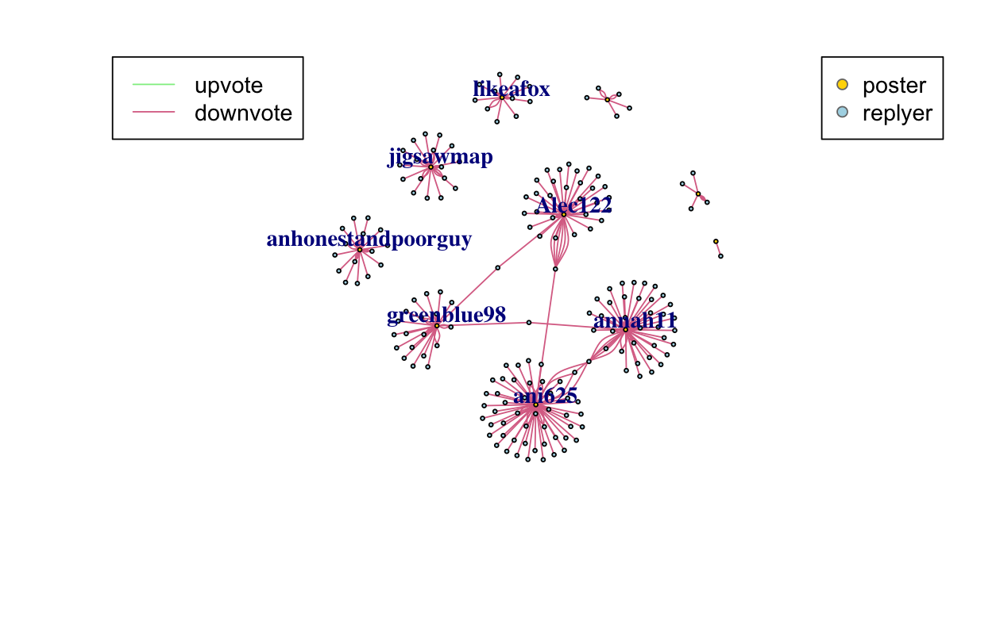
```

+ 三個不同社群之間（ani625, annah11, Alec122）是否對同一候選人有不同觀點？
+ 將被downvote較多的關聯拉出來看，發現是少數幾位橫跨多個社群的留言者被downvote

### 依據score繪製線條粗細
```{r}
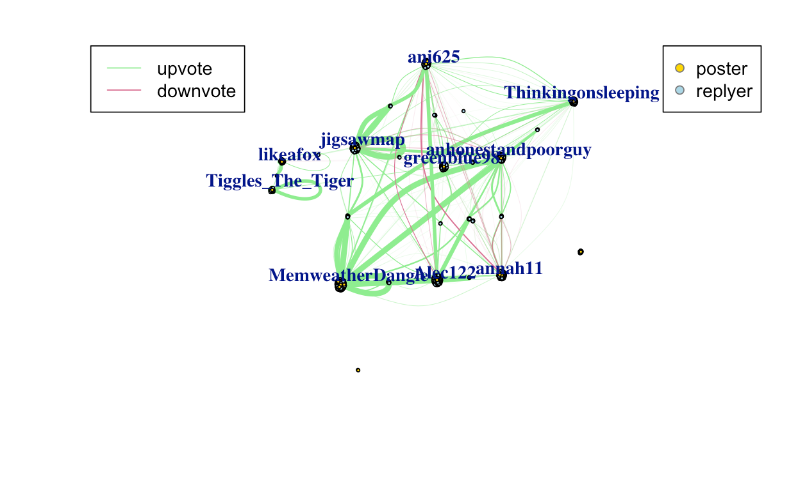
```

+ 按比例繪製後可發現downvote情況並不甚明顯

## 候選人網路分析

### Bernie Sanders狂粉網路圖

```{r, echo=FALSE}
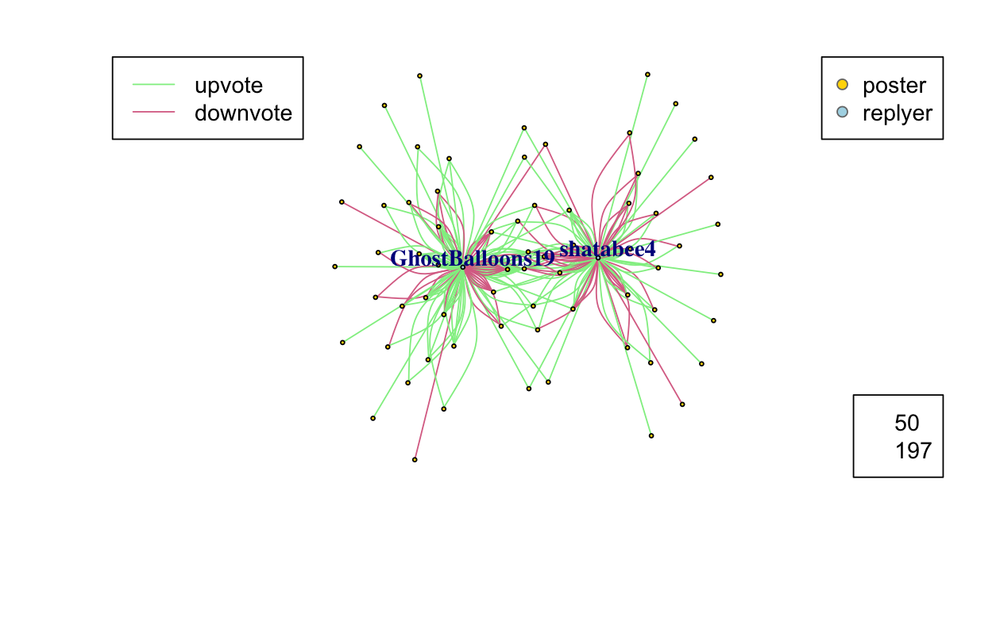
```

### Elizabeth Warren狂粉網路圖

```{r, echo=FALSE}
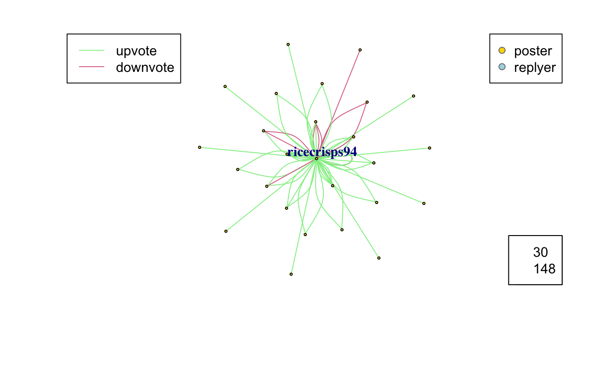
```

### Joe Biden狂粉網路圖

```{r, echo=FALSE}
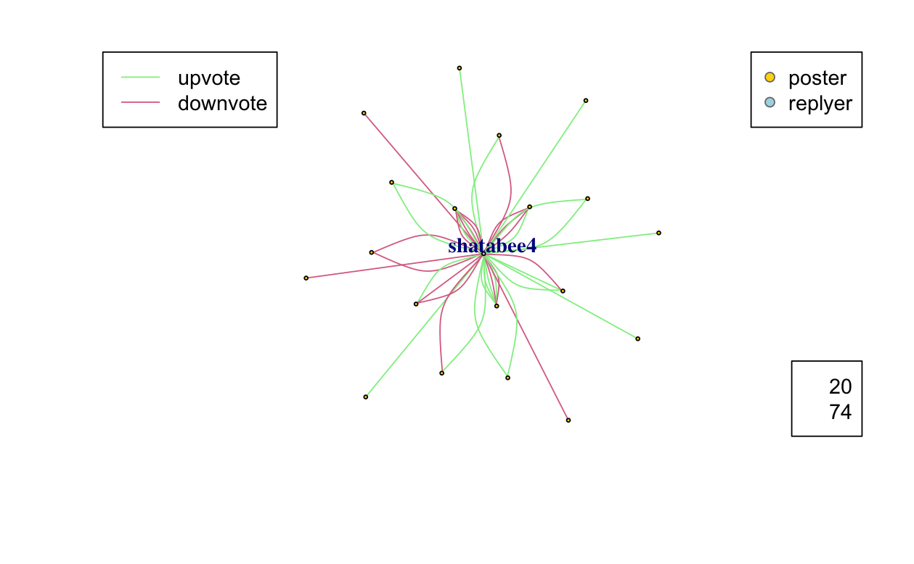
```

+ Bernie Sanders的鐵粉在50篇以上相關文章留言
+ 在多篇文章留言的網友被downvote的比率相對高
+ 從資料集中可看出shatabee4是進步派(Bernie Sanders, Elizabeth Warren)支持者，認為Bernie Sanders跟Elizabeth Warren分裂投票會讓Pete Buttigieg從中獲利，他反對billionaire干預大選，認為2008 Obama跟 2020 Pete Buttigieg表面是Cinderella story（皆是David Plouffe, David Axelrod負責操盤），但實際背後都是由billionaire所支持。


- - -

# 主題分析

## 前置作業

```{r message=FALSE, warning=FALSE, eval=F}
set.seed(42)
rows <- sample(nrow(politics))
politics <- politics[rows,]

reddit_tokens <- politics %>% 
  unnest_tokens(word,text) %>% 
  anti_join(stop_words) %>% 
  count(id, word) %>%
  rename(count=n)
reddit_tokens %>% head(20)

reddit_tokens$word <- lemmatize_words(reddit_tokens$word)
reddit_tokens <- reddit_tokens %>% anti_join(stop_words)

reserved_word <- reddit_tokens %>% 
  group_by(word) %>% 
  count() %>% 
  filter(n > 3)

tokens <- reddit_tokens %>% 
  filter(word %in% reserved_word$word)
```

### 將資料轉換為Document Term Matrix(DTM)
```{r eval=F}
reddit_dtm <- tokens %>% cast_dtm(id, word, count)
#reddit_dtm
inspect(reddit_dtm[1:10,1:10])
```

### 更多主題

+ 嘗試5,10,15,20,25主題數，將結果存起來，再做進一步分析
+ 這邊要跑N個小時，已將主題結果存在final_data.rdata
```{r eval=FALSE}
ldas = c()
topics = c(2,5,10,15,25)
for(topic in topics){
  start_time <- Sys.time()
  lda <- LDA(reddit_dtm, k = topic, control = list(seed = 2020))
  ldas =c(ldas,lda)
  print(paste(topic ,paste("topic(s) and use time is ", Sys.time() -start_time)))
  # save(ldas,file = "ldas_result.rdata")
}
```

### 透過perplexity找到最佳主題數

+ 最佳主題數為10
```{r eval=F}
# load("ldas_result") # 載入每個主題的LDA結果
topics = c(2,5,10,15,25)
tibble(k = topics,
           perplex = map_dbl(ldas, topicmodels::perplexity)) %>%
  ggplot(aes(k, perplex)) +
  geom_point() +
  geom_line() +
  labs(title = "Evaluating LDA topic models",
       subtitle = "Optimal number of topics (smaller is better)",
       x = "Number of topics",
       y = "Perplexity")
```

```{r, echo=FALSE}
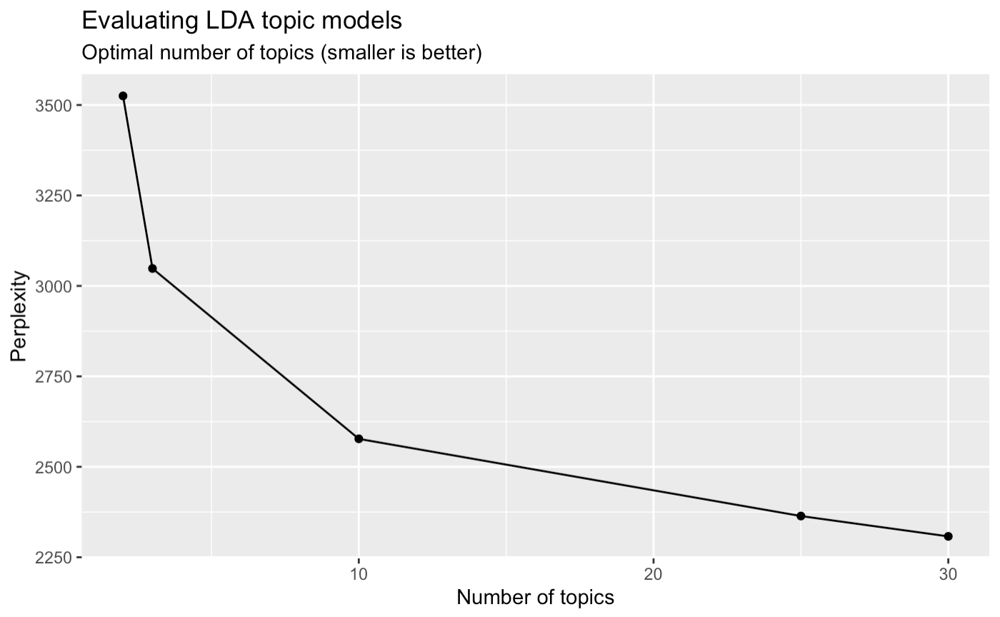
```

## LDA分析

### 建立LDA模型(10個主題)

```{r eval=F}
lda <- LDA(reddit_dtm, k = 10, control = list(seed = 2020))
```

### 主題-文字分析

```{r eval=F}
remove_word = c("bernie","sander","biden","warren","joe","guy","gonna","yeah","shit","fuck","lot","vote","people","im","candidate","support","supporter","president","ass","dude","bad","voter","dont","doesnt","didnt","debates","do","isnt","yes","happen","wont","id","real","feel","win","democratic","primary","trump","democrat","republican","bloomberg","party","time","campaign","election","dnc","medium")

# 看各群的常用詞彙
tidy(lda, matrix = "beta") %>%
  filter(! term %in% remove_word) %>% 
  group_by(topic) %>%
  top_n(20, beta) %>%
  ungroup() %>%
  mutate(topic = as.factor(topic),
         term = reorder_within(term, beta, topic)) %>%
  ggplot(aes(term, beta, fill = topic)) +
  geom_col(show.legend = FALSE) +
  facet_wrap(~ topic, scales = "free") +
  coord_flip() +
  scale_x_reordered()

topic_name<-c("富人稅、階級","挑選副手","None1","None2","None3","性騷擾醜聞","投票體制、郵寄選票","2016民主黨初選","Pandemic","healthcare")
```


```{r, echo=FALSE}
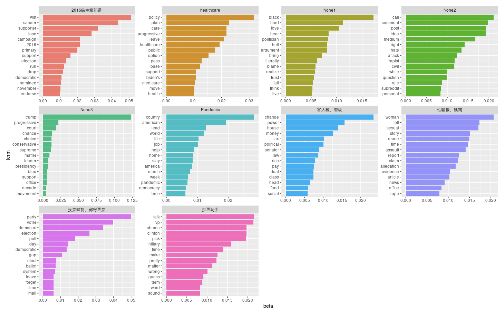
```

+ 富人稅、階級
+ 投票體制、郵寄選票
+ 2016民主黨初選
+ healthcare
+ 挑選副手
+ 性騷擾、醜聞
+ Pandemic

```{r eval=F}
# for every document we have a probability distribution of its contained topics
tmResult <- posterior(lda)
doc_pro <- tmResult$topics 
dim(doc_pro)               # nDocs(DTM) distributions over K topics

# get document topic proportions 
document_topics <- doc_pro[politics$id,]
document_topics_df =data.frame(document_topics)
colnames(document_topics_df) = topic_name
rownames(document_topics_df) = NULL
politics_topic = cbind(politics,document_topics_df)
politics_topic %>% head(10)
```

### 主題比例隨時間變化分析
```{r warning=FALSE, eval=F}
news_topic %>%
  filter( !format(date,'%Y%m') %in% c(202002,202004))%>%
  dplyr::select(-None) %>%
  group_by(cate = format(artDate,'%Y%m')) %>%
  summarise_if(is.numeric, sum, na.rm = TRUE) %>%
  melt(id.vars = "cate") %>%
  group_by(cate) %>%
  mutate(total_value =sum(value)) %>%
  ggplot( aes(x=cate, y=value/total_value, fill=variable)) + 
  geom_bar(stat = "identity") + ylab("proportion") + 
      scale_fill_manual(values=mycolors)+
  theme(axis.text.x = element_text(angle = 90, hjust = 1))
```


```{r, echo=FALSE}
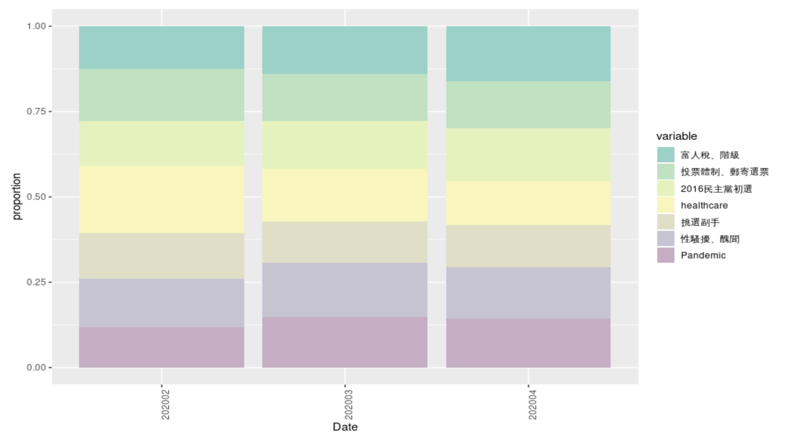
```

+ 我們預期Pandemic, healthcare, 富人稅這三個主題會隨著進入三四月而逐漸升溫，但healthcare卻意外是呈現下降的趨勢，推測因為二月有第九、十場辯論會，因此是healthcare主題討論的高潮。

+ 川普在4/7說到郵寄選票可能會有選舉舞弊的情況發生，可惜我們的資料集只到4/8，因此無法呈現出郵寄選票上升的趨勢，但可以發現二月時關於投票體制、郵寄選票的討論頗活躍，根據觀察那時主要討論是聚焦於大選低投票率（尤其是年輕人），跟後來四五六月因疫情影響、川普及共和黨反對郵寄選票等的討論方向不大相同。

+ 隨著進入四月，有關2016民主黨初選的討論出現上升，2016民主黨Bernie Sanders跟Hillary Clinton的競爭造成黨內進步派、溫和派分裂，因此今年是否會出現類似情形也是大家關注的重點
+ 挑選副手討論度不高，因為還在初選階段，尚未開始挑選副手
+ 隨著Biden成為民主黨總統會選人的可能性大增，性騷擾醜聞討論度也跟著上升

- - -

# Word2Vec應用分析

## 前置作業

+ 準備訓練資料
```{r eval=F}
reddit_comment_tokens_stop$word <- gsub(" ", "_", reddit_comment_tokens_stop$word) %>% tolower()
write.table(reddit_comment_tokens_stop$word, file = "asset/TR.txt",row.names = FALSE, sep = " ", quote = FALSE, na = "NA")
```

+ 成功訓練出來的字佔比: 986/5604 (17.5%)
```{r message=F, warning=F, results='hide'}
# train w2v
if (!file.exists("asset/word2vec.bin")) {model = train_word2vec("TR.txt","word2vec.bin",vectors=200,threads=8,window=12,iter=5,negative_samples=0)} else model = read.vectors("asset/word2vec.bin")
```

+ 「總統」、「民主」的相近字
```{r message=F, warning=F}
model %>% closest_to("president")    # 沒什麼特別的候選人組合出現
model %>% closest_to("democrats",15) # andrew_yang排在12
# candidates, win 都沒有候選人的名字
```


## 候選人相近字分析
```{r message=F, warning=F}
candidates = c("andrew_yang","michael_bloomberg","joe_biden","bernie_sanders","elizabeth_warren","amy_klobuchar","pete_buttigieg","tulsi_gabbard")
candidates_sim <- lapply(candidates,function(candidates){
                           model %>% closest_to(candidates)})

candidates_similarity <- data.frame(word = character(), similarity = double(), candidates = character())

for (i in 1:8){
  candidates_sim[[i]] <- candidates_sim[[i]] %>% mutate(candidates = candidates[i])
  candidates_similarity <- rbind(candidates_similarity, candidates_sim[[i]])
}
names(candidates_similarity)[2] = "similarity"
```

```{r message=F, warning=F}
candidates_similarity %>% 
  mutate(word = reorder(word, similarity)) %>% 
  filter(!word %in% candidates) %>% 
  ggplot(aes(word, similarity, fill = candidates)) +
  geom_col(show.legend = FALSE) +
  facet_wrap(~candidates, scales = "free_y") +
  labs(y = "similarity to candidates",
       x = NULL) +
  theme(text=element_text(size=12))+
  coord_flip()
```

+ 可以看出多為政策議題字，部分有特徵字(個人特徵、新聞輿論)
+ Amy Klobuchar
  + 議題：wealth(個人財富低調、謙虛的態度)、foreign(外交政策)
  + 特徵：communist(共產主義)、logic(顛覆了許多競選活動的邏輯)
+ Andrew Yang
  + 議題：fire(在競選活動慘敗後開除數名工作人員)、paperwork(因候選人文書問題未能參加初選)、chasing for California(募款活動)、future(矽谷創業家，提倡經濟、科技等具未來性的議題)
  + 特徵：color(亞裔)、california(父母為加州柏克萊分校研究生)
+ Bernie Sanders
  + 議題：mentally(全民醫療保險中的心理健康及藥物政策)、plant(關閉核能發電工廠)
  + 特徵：spectrum(在Spectrum Amphitheatre廣場舉行集會)
+ Elizabeth Warren
  + 議題：與Andrew Yang都提出對於稅金的政策
  + 特徵：native(美國原住民血統)、color(6位有色人種婦女離開她的競選團隊)
+ Joe Biden
  + 議題：opportunity(疫情流行是個改變的機會)
  + 特徵：refuse(拒絕對種族隔離主義者發表評論道歉)、awful(他不會是個很糟的候選人)
+ Michael Bloonderg
  + 議題：iraq(支持伊拉克戰爭)、covid(對抗疫情的計畫)
  + 特徵：act(演員Clint Eastwood對他表示支持)、double(增加廣告)
+ Pete Buttigieg
  + 特徵：serve和solid(軍人服役)、inexperience(沒經驗)、spread(敵方散布假消息)
+ Tulsi Gabbard
  + 議題：supreme(不反對最高法院的路易斯安那州墮胎法)
  + 特徵：suck(很糟)、centrist(中間派)、pac(超級政治行動委員會(Super PAC)的自由候選人，依靠財團捐款)、stein(被比喻為2016年綠黨總統候選人Jill Stein)


## 分群分析

```{r message=F, warning=F, fig.height=4}
candidates2 = c("andrew_yang","michael_bloomberg","joe_biden","bernie_sanders","elizabeth_warren")
term_set = lapply(candidates2, 
       function(candidates) {
          nearest_words = model %>% closest_to(model[[candidates]],10)
          nearest_words$word
        }) %>% unlist

subset = model[[term_set,average=F]]

hc = subset %>%
  cosineDist(subset) %>% 
  as.dist %>%
  hclust

fviz_dend(hc, k = 5,                 # Cut in four groups
          horiz = TRUE,
          k_colors = c("#2E9FDF", "#00AFBB", "#E7B800", "#FC4E07"),
          color_labels_by_k = TRUE,  # color labels by groups
          ggtheme = theme_gray()     # Change theme
          )

# colors = c("#2E9FDF", "#00AFBB", "#E7B800", "#FC4E07")
# clus4 = cutree(hc, 5)
# plot(as.phylo(hc), type = "fan", 
#      tip.color = colors[clus4],
#      cex= 0.8,
#      label.offset = 0.02)
```

+ 然而，效果不是很好，難以區別每一群的依據。


## PCA分析

+ 討論Joe Biden、Elizabeth Warren、Bernie Sanders、Andrew Yang、Michael Bloonderg的定位
```{r message=F, warning=F}
# 計算相近度的距離
all_candidate = model[[c("andrew_yang","michael_bloomberg","joe_biden","bernie_sanders","elizabeth_warren"),average=F]]

common_similarities_candidate = model[1:986,] %>% cosineSimilarity(all_candidate)
# common_similarities_candidate[1:20,]
```

```{r message=F, warning=F}
high_similarities_to_candidate = common_similarities_candidate[rank(-apply(common_similarities_candidate,1,max)) < 50,]

high_similarities_to_candidate =
high_similarities_to_candidate[which(
  !rownames(high_similarities_to_candidate) %in% candidates),] # 去除與維度相同的點(候選人)

highcharter::hchart(princomp(high_similarities_to_candidate, cor = TRUE))
```

+ 字詞大致與上一張候選人相近字圖相符
+ Joe Biden和Andrew Yang在方向上是較為相近的(Andrew Yang後來為Joe Biden背書)；與其相反的則是Elizabeth Warren和Micheal Bloomberg
+ Bernie Sanders相較於Joe Biden，與Elizabeth Warren較為接近(Bernie Sanders為打擊其對手Joe Biden，發表了支持Elizabeth Warren的演說)

## Word Analogy分析
```{r message=F, warning=F, results='hide', fig.keep='all'}
df_ana = data.frame()
for(name in candidates){
  ana = rword2vec::word_analogy(file_name = "asset//word2vec.bin", 
               search_words = paste0("joe_biden president ",name) , num = 5) %>% 
        mutate(candidate = name)
  ana$dist = ana$dist %>% as.numeric()
  df_ana = rbind(df_ana, ana)
}

df_ana %>% 
  mutate(word = reorder(word, dist)) %>% 
  filter(candidate != "joe_biden") %>% 
  ggplot(aes(word, dist, fill = candidate)) +
  geom_col(show.legend = FALSE) +
  facet_wrap(~candidate, scales = "free_y") +
  ggtitle("joe_biden is to president, as who is to ___.") +
  theme(text=element_text(size=12))+
  coord_flip()
```

+ 我們預期從此圖看到一些候選人選情的字，然而出現的字都很重複，主要為blue(民主黨的顏色)、sad跟anti，與前面只看president的相近字最近的幾個字。
+ 仍可看出一些對應候選人各自的特徵(部分沒有出現在候選人相近字裡)，例如：
  + hampshire是Tulsi競選的州
  + Amy Klobuchar也有提出mentally health的政策
  
- - -

# 期末結論(6/16)

我們利用Reddit的留言資料，探索在總統初選中網友討論的主題，又分別對候選人做個人特定議題的分析。<br>
相較期中只能粗略的分析候選人情緒、透過字頻(tf-idf)找出特別字，這次我們使用了更進階的技巧(如：社會網路分析、LDA模型找出主題和Word Embedding)，使後續的分析更有針對性。<br>
<br>
從LDA的主題分析，我們發現討論議題大多圍繞在候選人的政策、醜聞、選舉的制度及走向等；而在文字向量的分析裡，則看出每個候選人提出的政策議題及屬於自己特定的特徵字。<br>
另外，使用PCA也發現觀察值大致符合前面看到的現象。比較特別的是，透過維度射向的方位，我們可以判斷候選人之間不同的定位。<br>
<br>
經過這些分析，讓我們更了解輿情分析的方法，並找出大眾感興趣的議題。<br>
然而由於Reddit留言討論熱度很高且每層樓底下都會在針對單一留言擴大討論，資料結構較複雜，若想從網路圖看出某種規律需要花一些心力定義有效且有意義的範圍；而Word Embedding的部分，由於訓練出來的字彙量不多，若拿去分析比較通用的字詞(如：president)的效果不佳，相似度最高僅20幾%，但若是分析專有名詞(如：候選人名)則表現很好，會出現與之對應的特徵詞。<br>