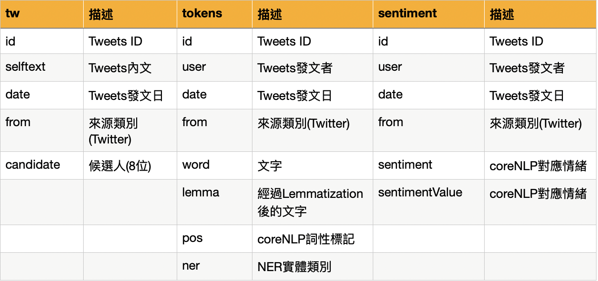
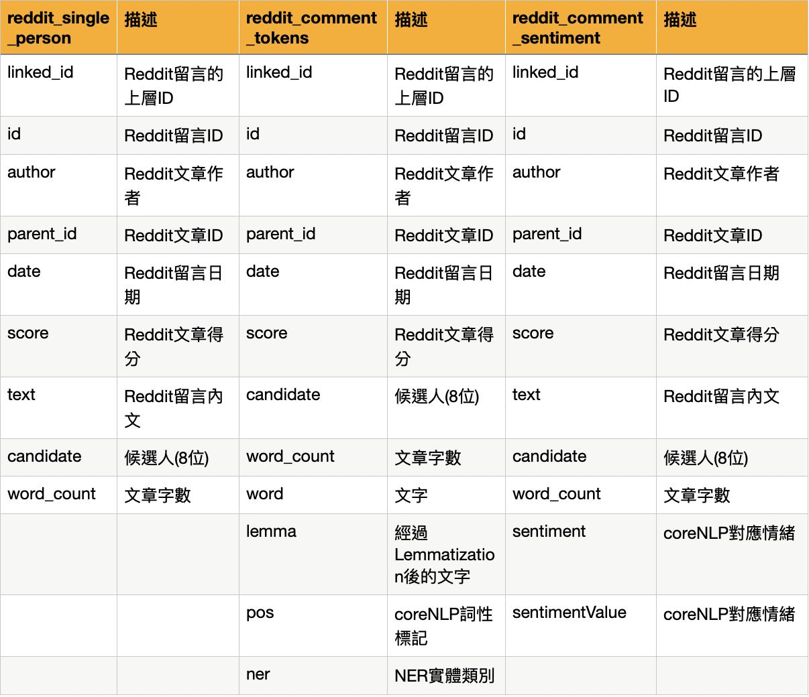
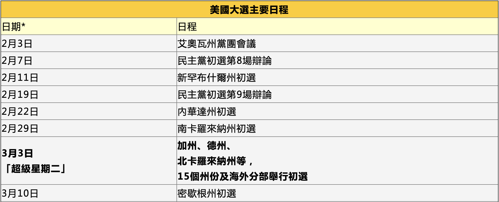
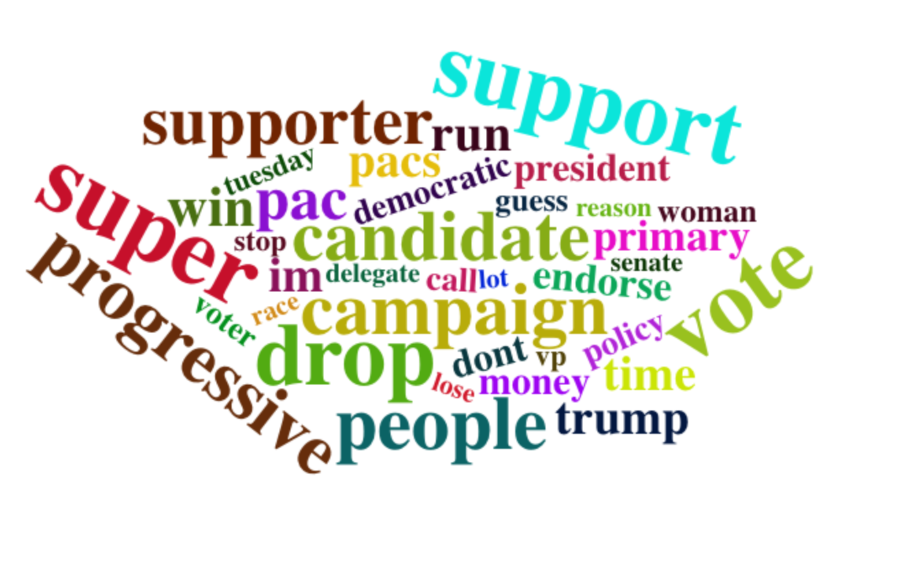

# 1. 動機和分析目的

美國總統大選將至，最受矚目的莫過於各州初選及辯論會的激戰。 </br>
這次的分析主要是針對民主黨的8位候選人，藉由Reddit和Twitter上的文章發表、評論等，觀察網路上的話題趨勢、對不同候選人的討論熱度以及大眾的情緒變化。我們好奇分析後的結果是否能驗證辯論會、初選的走勢。

- - -

# 2. 資料集介紹

### 2.1 資料來源

原始資料：

+ Twitter: 5232筆
    + 時間：2020/01/02-2020/03/31
+ Reddit Comment：2,230,127筆
    + 時間：2019/09/22-2020/04/08
    + Pete Buttigieg：245,520筆
    + Joe Biden：245,024筆
    + Bernie Sanders：248,741筆
    + Michael Bloomberg：244,524筆
    + Andrew Yang：244,032筆
    + Democratic Primary：234,612筆
    + Elizabeth Warren：243,540筆
    + Tulsi Gabbard：222,460筆
    + Amy Klobuchar：150,960筆

篩選後使用資料：

+ Twitter：
    + tw：Raw Data，共3694筆。
    + tokens：164,220筆
    + sentiment：5220筆
+ Reddit Comment：
    + reddit_single_person：只提到一次候選人的留言，共115,623筆。
    + reddit_comment_tokens：70,710筆
    + reddit_comment_sentiment：3150筆

### 2.2 變數介紹

{width=550px}

{width=550px}


- - -

# 3.資料分析過程

1. 收集資料
    + Twitter
        + 使用Python的twitterscraper套件
        + 該套件用beautifulsoup去爬整個頁面，沒有經過tweet的api所以不用辦token，也無過去7天的限制。
        + 缺點：只會爬特定幾個區域伺服器下的tweets，造成某些日期(如：2/19)就只有2筆資料的問題。
    + Reddit Comment
        + 使用PRAW: The Python Reddit API Wrapper在subreddit="politics"進行爬蟲，搜尋關鍵字分別為八位候選人&Democratic Primary。
        + 因留言比數過多，故只抓前五頁的留言。
        + 沒有時間、筆數限制。
2. 資料前處理
    + 準備套件
    + 讀取資料
        + 定義用於資料清理的Function
        + 使用coreNLP進行Lemmatization，解析POS/NER/Sentiment
        + 整理資料
        + 斷詞/斷句
        + 停用字/自訂辭典(候選人姓名)
3. 資料視覺化
    + 文字雲
    + 初選特定事件分析
    + 情緒分析
        + Afinn字典
        + coreNLP
    + Bernie Sanders、Elizabeth Warren、Joe Biden分析
    + 共線相關圖分析
        + 2-gram
        + 3-gram
4. 結論

- - -

# 4.資料前處理

## 4.1 準備套件

```{r message=FALSE, warning=FALSE}
pacman::p_load("tidyverse", "data.table", "plotly" ,"xml2", "httr", "jsonlite", "NLP", "igraph", "sentimentr", "tidytext", "d3heatmap", "tidyr", "scales", "wordcloud", "lubridate", "textdata", "ggraph")
load("all_rmd_data.rdata")
# load("fin_data_tweets.rdata")
# load("reddit_coreNLP.RData")
# rm(list = ls()[!(ls() %in% c('tw','tokens','sentiment','reddit_comment','reddit_comment_partial'))])
```


## 4.2 資料清理

### 定義用於資料清理的Function

```{r eval=F}
# 一次讀取多個檔案
fun <- function(t){
  files <- list.files(path = t, pattern = "*.csv",recursive = TRUE) #檔案路徑
  df1 <- data.frame()
  for(file in files) {
    tmp<- fread(paste(t, file, sep="")) #讀進檔案
    l = list(df1,tmp)
    df1=rbindlist(l, use.names=TRUE, fill=TRUE)
  }
  return(df1)
}

# 資料清理
clean = function(txt) {
  txt = iconv(txt, "latin1", "ASCII", sub="") #轉換字符編碼
  txt = gsub("(@|#)\\w+", "", txt) #去除@或#後有數字,字母,底線 (標記人名或hashtag)
  txt = gsub("(http|https)://.*", "", txt) #去除網址
  txt = gsub("[ \t]{2,}", "", txt) #去除兩個以上空格或tab
  txt = gsub("\\n"," ",txt) #去除換行
  txt = gsub("\\s+"," ",txt) #去除一個或多個空格
  txt = gsub("^\\s+|\\s+$","",txt) #去除前後一個或多個空格
  txt = gsub("&.*;","",txt) #去除html特殊字元編碼
  txt = gsub("[^a-zA-Z0-9?!. ']","",txt) #除了字母,數字 ?!. ,空白的都去掉
  txt }
```

### 定義coreNLP用的Function


#### 串接CoreNLP API

server端 :

+ 需先在terminal開啟corenlp server
+ 在corenlp的路徑下開啟terminal輸入 `java -mx4g -cp "*" edu.stanford.nlp.pipeline.StanfordCoreNLPServer -port 9000 -timeout 15000`

```{r eval=FALSE}
# 生產core-nlp的api url，可以設定斷詞依據、以及要標註的任務
generate_API_url <- function(host, port="9000",
                    tokenize.whitespace="false", annotators=""){ #斷詞依據不是空格
    url <- sprintf('http://%s:%s/?properties={"tokenize.whitespace":"%s","annotators":"%s"}',
                     host, port, tokenize.whitespace, annotators)
    url <- URLencode(url)
}
generate_API_url("127.0.0.1")
```

```{r eval=FALSE}
# 呼叫core-nlp api
call_coreNLP <- function(server_host, text, host="localhost", language="eng",
                    tokenize.whitespace="true", ssplit.eolonly="true", annotators=c("tokenize","ssplit","pos","lemma","ner","parse","sentiment")){
  # 假設有兩個core-nlp server、一個負責英文（使用9000 port）、另一個則負責中文（使用9001 port）
  port <- ifelse(language=="eng", 9000, 9001);
  # 產生api網址
  url <- generate_API_url(server_host, port=port,
                    tokenize.whitespace=tokenize.whitespace, annotators=paste0(annotators, collapse = ','))
  
  result <- POST(url, body = text, encode = "json")
  doc <- httr::content(result, "parsed","application/json",encoding = "UTF-8")
  return (doc)
}
```

```{r eval=FALSE}
host = "127.0.0.1"
coreNLP <- function(data,host){
  # 依序將每個文件丟進core-nlp進行處理，每份文件的回傳結果為json格式
  # 在R中使用objects來儲存處理結果
  result <- apply(data, 1 , function(x){
    #object <- call_coreNLP(host, x['text'])
    object <- tryCatch({
        output <- call_coreNLP(host, x['text'])
    }, error = function(e) {
      print("error occur here")
      print(x['text'])
    })
    
    list(doc=object, data=x)
  })
  
  return(result)
}
```

#### 取得coreNLP回傳的物件
```{r eval=FALSE}
gc() # 釋放不使用的記憶體

t0 = Sys.time()
obj = data %>% filter(text != "") %>% coreNLP(host) # twitter文章
obj2  = reddit_date_sampling %>% filter(text != "") %>% coreNLP(host) #comments
# 丟入coreNLP的物件 必須符合: 是一個data.frame 有一個text欄位
Sys.time() - t0 # 執行時間
# Time difference of 14 mins

save.image("tweets_coreNLP.RData")
```

#### 整理斷詞出結果並輸出為tokens
```{r eval=F}
coreNLP_tokens_parser <- function(coreNLP_objects){
  
  result <- do.call(rbind, lapply(coreNLP_objects, function(obj){
    original_data <- obj$data
    doc <- obj$doc
    # for a sentences
    sentences <- doc$sentences
   
    sen <- sentences[[1]]
    
    tokens <- do.call(rbind, lapply(sen$tokens, function(x){
      result <- data.frame(word=x$word, lemma=x$lemma, pos=x$pos, ner=x$ner)
      result
    }))
    
    tokens <- original_data %>%
      t() %>% 
      data.frame() %>% 
      select(-text) %>% 
      slice(rep(1:n(), each = nrow(tokens))) %>% 
      bind_cols(tokens)
    
    tokens
  }))
  return(result)
}
```

#### 整理出語句情緒並輸出為sentiment
```{r eval=F}
coreNLP_sentiment_parser <- function(coreNLP_objects){
  result <- do.call(rbind, lapply(coreNLP_objects, function(obj){
    original_data <- obj$data
    doc <- obj$doc
    # for a sentences
    sentences <- doc$sentences
    sen <- sentences[[1]]
    
    sentiment <- original_data %>%
      t() %>% 
      data.frame() %>% 
      bind_cols(data.frame(sentiment=sen$sentiment, sentimentValue=sen$sentimentValue))
  
    sentiment
  }))
  return(result)
}
```

## 4.3 讀取Twitter資料

+ tw：原始資料
+ tokens：經過coreNLP後的Twitter資料
+ sentiment：經過coreNLP後的Twitter資料
```{r eval=F}
# raw data
tw <- fread('./tweets.csv') %>% #讀進檔案
  mutate(from = "tweets") %>% #新增欄位分類
  select(screen_name, text, timestamp, from)
names(tw)[1] = "id" 
names(tw)[2] = "selftext"
names(tw)[3] = "date"
tw$date=as.Date(tw$date)
tw<-tw%>%filter(selftext!="")
tw$selftext = clean(tw$selftext)
# nlp tokens
tokens =  coreNLP_tokens_parser(obj) # 164,220
# nlp sentiment
sentiment =  coreNLP_sentiment_parser(obj) # 5220
```

```{r}
tw %>% 
  count(date) %>% 
  ggplot(aes(x=date, y=n)) + 
  geom_line() + 
  scale_x_date(labels = date_format("%Y/%m/%d")) + 
  ggtitle("每天留言數量") + 
  theme(text = element_text(family = "蘋方-繁 中黑體")) #加入中文字型設定，避免中文字顯示錯誤。
```


#### 新增候選人欄位
```{r message=FALSE, warning=FALSE, eval=F}
# tw
tw$candidate <- ifelse(grepl("Andrew",tw$selftext, ignore.case = T),"Andrew Yang",
              ifelse(grepl("Yang",tw$selftext, ignore.case = T),"Andrew Yang",
              ifelse(grepl("Michael",tw$selftext, ignore.case = T),"Michael Bloomberg",
              ifelse(grepl("Bloomberg",tw$selftext, ignore.case = T),"Michael Bloomberg",
              ifelse(grepl("Joe",tw$selftext, ignore.case = T),"Joe Biden",
              ifelse(grepl("Biden",tw$selftext, ignore.case = T),"Joe Biden",
              ifelse(grepl("Bernie",tw$selftext, ignore.case = T),"Bernie Sanders",
              ifelse(grepl("Sanders",tw$selftext, ignore.case = T),"Bernie Sanders",
              ifelse(grepl("Elizabeth",tw$selftext, ignore.case = T),"Elizabeth Warren",
              ifelse(grepl("Warren",tw$selftext, ignore.case = T),"Elizabeth Warren",
              ifelse(grepl("Amy",tw$selftext, ignore.case = T),"Amy Klobuchar",
              ifelse(grepl("Klobuchar",tw$selftext, ignore.case = T),"Amy Klobuchar",
              ifelse(grepl("Pete",tw$selftext, ignore.case = T),"Pete Buttigieg",
              ifelse(grepl("Buttigieg",tw$selftext, ignore.case = T),"Pete Buttigieg",
              ifelse(grepl("Tulsi",tw$selftext, ignore.case = T),"Tulsi Gabbard",
              ifelse(grepl("Gabbard",tw$selftext, ignore.case = T),"Tulsi Gabbard",
                     "Others"
                     ))))))))))))))))
tw <- tw %>% filter(candidate!="Others")

# sentiment
tweets_partial <- sentiment
tweets_partial$candidate<-ifelse(grepl("Andrew",tweets_partial$text, ignore.case = T),"Andrew Yang",
              ifelse(grepl("Yang",tweets_partial$text, ignore.case = T),"Andrew Yang",
              ifelse(grepl("Michael",tweets_partial$text, ignore.case = T),"Michael Bloomberg",
                     ifelse(grepl("Bloomberg",tweets_partial$text, ignore.case = T),"Michael Bloomberg",
              ifelse(grepl("Biden",tweets_partial$text, ignore.case = T),"Joe Biden",
              ifelse(grepl("Joe",tweets_partial$text, ignore.case = T),"Joe Biden",
              ifelse(grepl("Bernie",tweets_partial$text, ignore.case = T),"Bernie Sanders",
              ifelse(grepl("Sanders",tweets_partial$text, ignore.case = T),"Bernie Sanders",
              ifelse(grepl("Warren",tweets_partial$text, ignore.case = T),"Elizabeth Warren",
              ifelse(grepl("Klobuchar",tweets_partial$text, ignore.case = T),"Amy Klobuchar",
              ifelse(grepl("Gabbard",tweets_partial$text, ignore.case = T),"Tulsi Gabbard",
              ifelse(grepl("Buttigieg",tweets_partial$text, ignore.case = T),"Pete Buttigieg",
              ifelse(grepl("Tulsi",tweets_partial$text, ignore.case = T),"Tulsi Gabbard",

                     "Others"
                     )))))))))))))
tweets_sentiment_candidate <- tweets_partial%>%filter(candidate!="Others")
```

#### 型態轉換
```{r message=FALSE, warning=FALSE, eval=F}
# 轉回character
tokens = as.tibble(tokens) %>% mutate_if(is.factor,as.character) 
# 轉日期
tokens$date = as.Date(tokens$date, "%Y-%m-%d")
```

#### 停用字與自訂辭典
```{r message=FALSE, warning=FALSE, eval=F}
# stopword
tokens$lemma = gsub("[0-9!?.]*", "", tokens$lemma)
data(stop_words) 
tokens_stop = tokens %>% 
  unnest_tokens(word, lemma) %>%
  anti_join(stop_words)

# 自訂辭典(候選人姓名)
pattern = c("^pete|^buttigieg$", "^joe|^biden$",
            "^bernie|^sanders$", "^michael|^bloomberg$",
            "^andrew|^yang$",  "^elizabeth|^warren$",
            "^tulsi|^gabbard$", "^amy|^klobuchar$",
            "^democratic|^primary$",
            "^trump|^donald$", "^hillary|^clinton$")

name = c("pete buttigieg", "joe biden",
         "bernie sanders", "michael bloomberg",
         "andrew yang", "elizabeth warren",
         "tulsi gabbard", "amy klobuchar",
         "democratic primary", 
         "trump donald", "hillary clinton")

for (i in 1:length(name)){
    tokens_stop$word = gsub(pattern[i], name[i], tokens_stop$word)
  }
```


## 4.4 讀取Reddit Comment資料

#### 篩選到Twitter一致的時間範圍

+ reddit_comment_partial：取時間從2020年開始的資料，共454,672筆。
```{r eval=F}
# 載入各個候選人的comments
reddit_comment<-fun("./reddit/politics_comments/")
# 資料清理
reddit_comment<-reddit_comment[!duplicated(reddit_comment),]%>%filter(body!=""&body!="[刪除]")
reddit_comment$link_id <- substr(reddit_comment$link_id, start = 4, stop = length(reddit_comment$link_id)) #修改id
reddit_comment$parent_id <- substr(reddit_comment$parent_id, start = 4, stop = length(reddit_comment$parent_id)) #修改id
names(reddit_comment)[6] = "date"
names(reddit_comment)[9]="text"
reddit_comment$text = clean(reddit_comment$text)
reddit_comment=reddit_comment[,c(1:9)]
reddit_comment$date=as.Date(reddit_comment$date,"%m-%d-%Y") # raw data刪掉duplicate
# 篩選與Twitter一致的時間範圍
reddit_comment_partial<-reddit_comment[reddit_comment$date>="2020-01-01",] # 2020開始
```

#### 挑選出只提到一次候選人的留言(109546)，並標註候選人

+ reddit_single_person：只提到一次候選人的留言，共115,623筆。
```{r message=FALSE, warning=FALSE, eval=F}
reddit_comment_partial$Bernie<-ifelse(grepl("Bernie",reddit_comment_partial$text, ignore.case = T),1,ifelse(grepl("Sanders",reddit_comment_partial$text, ignore.case = T),1,0))

reddit_comment_partial$Andrew<-ifelse(grepl("Andrew",reddit_comment_partial$text, ignore.case = T),1,ifelse(grepl("Yang",reddit_comment_partial$text, ignore.case = T),1,0))

reddit_comment_partial$Biden<-ifelse(grepl("Joe",reddit_comment_partial$text, ignore.case = T),1,ifelse(grepl("Biden",reddit_comment_partial$text, ignore.case = T),1,0))

reddit_comment_partial$Bloomberg<-ifelse(grepl("Michael",reddit_comment_partial$text, ignore.case = T),1,ifelse(grepl("Bloomberg",reddit_comment_partial$text, ignore.case = T),1,0))

reddit_comment_partial$Buttigieg<-ifelse(grepl("Pete",reddit_comment_partial$text, ignore.case = T),1,ifelse(grepl("Buttigieg",reddit_comment_partial$text, ignore.case = T),1,0))

reddit_comment_partial$Amy<-ifelse(grepl("Amy",reddit_comment_partial$text, ignore.case = T),1,ifelse(grepl("Klobuchar",reddit_comment_partial$text, ignore.case = T),1,0))

reddit_comment_partial$Warren<-ifelse(grepl("Elizabeth",reddit_comment_partial$text, ignore.case = T),1,ifelse(grepl("Warren",reddit_comment_partial$text, ignore.case = T),1,0))

reddit_comment_partial$Gabbard<-ifelse(grepl("Tulsi",reddit_comment_partial$text, ignore.case = T),1,ifelse(grepl("Gabbard",reddit_comment_partial$text, ignore.case = T),1,0))

reddit_comment_partial$sum<-rowSums(reddit_comment_partial[,c("Bernie","Andrew","Bloomberg","Biden","Amy","Warren","Gabbard")])

reddit_single_person <- reddit_comment_partial%>%filter(sum==1)
reddit_single_person <- reddit_single_person[,1:9]
```

```{r}
reddit_single_person %>% 
  count(date) %>% 
  ggplot(aes(x=date, y=n)) + 
  geom_line() + 
  scale_x_date(labels = date_format("%Y/%m/%d")) + 
  ggtitle("每天留言數量") + 
  theme(text = element_text(family = "蘋方-繁 中黑體")) #加入中文字型設定，避免中文字顯示錯誤。
```

#### 新增候選人欄位
```{r message=FALSE, warning=FALSE, eval=F}
reddit_single_involved$candidate<-ifelse(grepl("Andrew",reddit_single_involved$text, ignore.case = T),"Andrew Yang",
              ifelse(grepl("Yang",reddit_single_involved$text, ignore.case = T),"Andrew Yang",
              ifelse(grepl("Michael",reddit_single_involved$text, ignore.case = T),"Michael Bloomberg",
                     ifelse(grepl("Bloomberg",reddit_single_involved$text, ignore.case = T),"Michael Bloomberg",
              ifelse(grepl("Joe",reddit_single_involved$text, ignore.case = T),"Joe Biden",
              ifelse(grepl("Biden",reddit_single_involved$text, ignore.case = T),"Joe Biden",
              ifelse(grepl("Bernie",reddit_single_involved$text, ignore.case = T),"Bernie Sanders",
              ifelse(grepl("Sanders",reddit_single_involved$text, ignore.case = T),"Bernie Sanders",
              ifelse(grepl("Elizabeth",reddit_single_involved$text, ignore.case = T),"Elizabeth Warren",
              ifelse(grepl("Warren",reddit_single_involved$text, ignore.case = T),"Elizabeth Warren",
               ifelse(grepl("Amy",reddit_single_involved$text, ignore.case = T),"Amy Klobuchar",       
              ifelse(grepl("Klobuchar",reddit_single_involved$text, ignore.case = T),"Amy Klobuchar",
              
              ifelse(grepl("Pete",reddit_single_involved$text, ignore.case = T),"Pete Buttigieg",
              ifelse(grepl("Buttigieg",reddit_single_involved$text, ignore.case = T),"Pete Buttigieg",
              ifelse(grepl("Tulsi",reddit_single_involved$text, ignore.case = T),"Tulsi Gabbard",
              ifelse(grepl("Gabbard",reddit_single_involved$text, ignore.case = T),"Tulsi Gabbard",
                     "Others"
                     ))))))))))))))))
```

#### 用字數剔除一些資料，並配合不同的焦點篩選資料做coreNLP

因為Reddit Comment資料量太大，我們會選擇篩選字數小於100的資料，並用亂數挑選的方式來呈現較長時期的現象，取到資料量與twitter資料差不多等級的筆數，針對有興趣的事件或候選人再將其範圍縮小取後，即可取得單位時間較多且較多元的資料。

```{r message=FALSE, warning=FALSE, eval=F}
# 生成一個欄位叫word_count儲存text的字數
reddit_single_person$word_count = str_count(reddit_single_person$text, "\\w+")

reddit_single_person %>% 
  filter(word_count < 200) %>% 
  group_by(word_count) %>% 
  summarise(count = n()) %>% 
  ggplot(aes(x=word_count, y=count)) + 
  geom_line() +
  ggtitle("字數分佈") + 
  theme(text = element_text(family = "蘋方-繁 中黑體")) #加入中文字型設定，避免中文字顯示錯誤。
```

```{r message=FALSE, warning=FALSE, eval=F}
reddit_date_sampling <- reddit_single_person %>% 
  filter(word_count <= 50) %>% 
  group_by(date) %>% 
  sample_n(30)

# nlp tokens
reddit_comment_tokens =  coreNLP_tokens_parser(obj2) # 70710 obs
# nlp sentiment
reddit_comment_tokens =  coreNLP_tokens_parser(obj2) # 3150 obs
```

#### 型態轉換
```{r message=FALSE, warning=FALSE, eval=F}
# 轉回character
reddit_comment_tokens = as.tibble(reddit_comment_tokens) %>% mutate_if(is.factor,as.character) 
# 轉日期
reddit_comment_tokens$date = as.Date(reddit_comment_tokens$date, "%Y-%m-%d")
```

#### 停用字與自訂辭典
```{r message=FALSE, warning=FALSE, eval=F}
reddit_comment_tokens$lemma = gsub("[0-9!?.]*", "", reddit_comment_tokens$lemma)
# stopword
reddit_comment_tokens_stop = reddit_comment_tokens %>% 
  unnest_tokens(word, lemma) %>%
  anti_join(stop_words)

# 自訂辭典(候選人姓名)
pattern = c("^pete|^buttigieg$", "^joe|^biden$",
            "^bernie|^sanders$", "^michael|^bloomberg$",
            "^andrew|^yang$",  "^elizabeth|^warren$",
            "^tulsi|^gabbard$", "^amy|^klobuchar$",
            "^democratic|^primary$",
            "^trump|^donald$", "^hillary|^clinton$")

name = c("pete buttigieg", "joe biden",
         "bernie sanders", "michael bloomberg",
         "andrew yang", "elizabeth warren",
         "tulsi gabbard", "amy klobuchar",
         "democratic primary", 
         "trump donald", "hillary clinton")

for (i in 1:length(name)){
    reddit_comment_tokens_stop$word = gsub(pattern[i], name[i], reddit_comment_tokens_stop$word)
  }
```


- - -


# 5. 資料視覺化


## 5.1 NER分析
```{r}
# 辨識出哪幾種類型的實體
levels(as.factor(tokens$ner))
levels(as.factor(reddit_comment_tokens_stop$ner))
# 除去Entity為Other，有多少種word有被標註entity
length(unique(tokens$word[tokens$ner != "O"])) # 3290
length(unique(reddit_comment_tokens_stop$word[reddit_comment_tokens_stop$ner != "O"])) # 773
```

### 人物NER

談論民主黨初選議題，所涉及的人物
```{r message=FALSE, warning=FALSE}
x = c("PERSON","COUNTRY","IDEOLOGY")

wf = function(x){ tokens_stop %>%
  filter(ner == x) %>%  #篩選NER為COUNTRY
  count(word) %>%
  mutate(from = "Twitter",
         freq = n/sum(n),
         word = reorder(word, freq)) %>% 
  rbind(
    reddit_comment_tokens_stop %>%
    filter(ner == x) %>%  #COUNTRY
    count(word) %>%
    mutate(from = "Reddit",
           freq = n/sum(n),
           word = reorder(word, freq))
) %>% 
  top_n(15, wt=freq) %>% 
  ggplot(aes(word, freq, fill = from)) + 
  geom_col(position="dodge",show.legend = F)+
  ggtitle(paste0("Word Frequency (NER is ",x,")")) +
  theme(text=element_text(size=14))+
  coord_flip() -> p
ggplotly(p)
}

wf(x[1])
```


### 國家NER

談論民主黨初選議題，所涉及的國家
```{r}
wf(x[2])
```


### 思想NER

談論民主黨初選議題，所涉及的國家
```{r}
wf(x[3])
```


## 5.2 初選特別事件分析

民主黨初選各州的投票日期皆不同，從2/3開始到6/6結束。以下將挑具有熱門話題的事件，切時間點(主要為2月~3月的事件)去觀察他們對選情的影響。




### 民主黨第9次電視辯論會（2/19）

+ 2/21 美國有線電視新聞網（CNN）的政治評論員在星期四晚上張貼了一張手機圖片，手機背面的標籤上寫著“Yang2024”。美國風險投資公司創始人的支持者（其中許多人仍然在主要投票中讚成楊）對這則推文做出了積極反應。
+ 2/19 Sanders在民意調查中處於領先地位，biden位居第二。
```{r message=FALSE, warning=FALSE}
event = function(x, title=1, min_date, max_date, event_date){
  title = ifelse(title==1, "Twitter", "Reddit")
  x %>% filter(date > min_date & date < max_date & ner=="PERSON") %>% 
  filter(word %in% name[1:8]) %>% 
  count(date, word) %>% 
  bind_tf_idf(word, date, n) %>% 
  arrange(desc(tf)) %>% 
  ggplot(aes(date, tf, col=word)) +
  geom_line(show.legend = F) + 
  geom_point(show.legend = F) +
  geom_vline(xintercept = as.numeric(ymd(event_date)), linetype="dashed", 
                color = "gray", size=0.7) +
  ggtitle(paste0(title,"前/後一週候選人變化"))->p
ggplotly(p)
}

event(tokens_stop, 1, "2020-02-12", "2020-02-26", "2020-02-19")
event(reddit_comment_tokens_stop, 2, "2020-02-12", "2020-02-26", "2020-02-19")
```


### 民主黨第10次電視辯論會（2/25）

+ 2/25 Elizabeth Warren攻擊Bloomberg關於女性性別歧視的議題，描述Bloomberg的公司, Bloomberg LP前僱員Sekiko Sakai Garrison的指控。在1998年的一次訴訟中，Garrison說，當她告訴Bloomberg她懷孕時，他告訴她“殺死它”。
+ Biden對Sanders的槍枝管制提出批評
```{r}
event(tokens_stop, 1, "2020-02-18", "2020-03-03", "2020-02-25")
event(reddit_comment_tokens_stop, 2, "2020-02-18", "2020-03-03", "2020-02-25")
```


### 超級星期二（3/3）

+ 3/3 Bernie Sanders在超級星期二初選中被喬·拜登（Joe Biden）超越
+ 3/7 一名男子在民主黨總統候選人在亞利桑那州的一次活動中發表講話時解開納粹旗幟 。Bernie Sanders週日表示，他“從未期望他作為美國人的生活”看到納粹國旗在一次重大政治集會上揮舞。該事件引起了強烈抗議，在社交媒體上遭到了廣泛譴責，並引發了對安全的呼籲。
```{r}
event(tokens_stop, 1, "2020-02-25", "2020-03-10", "2020-03-03")
event(reddit_comment_tokens_stop, 2, "2020-02-25", "2020-03-10", "2020-03-03")
```


### Warren宣布退出初選（3/5）

#### 話題人物當週變化

##### Twitter

+ 從本張圖也可以看出3/3超級星期二討論度上升，且Trump和Elizabeth被討論的次數最多
+ 但我們想觀察的Warren宣布退選並沒有比較特別引起討論，Warren哭哭
```{r}
heat = function(x){
  x %>% filter(date>"2020-03-01" & date<"2020-03-07" & ner=="PERSON") %>% 
  count(date, word) %>% 
  bind_tf_idf(word, date, n) %>% 
  arrange(desc(tf_idf)) %>% 
  head(100) %>% 
  select("word","date") %>% 
  table() %>% 
  as.data.frame.matrix %>% 
  d3heatmap(F,F,col=colorRamp(c('lightyellow','red')), show_grid = F, xaxis_font_size="10pt")
}

heat(tokens_stop)
```

##### Reddit
```{r}
heat(reddit_comment_tokens_stop)
```

## 5.3 情緒分析

### AFINN字典

#### Twitter
```{r message=FALSE, warning=FALSE, eval=F}
tw_unnest<-tw%>%unnest_tokens(word,selftext)%>%
            filter(word!=stop_words$word)
afinn<-lexicon_afinn()
tw_afinn<-tw_unnest%>%
  inner_join(afinn)%>%
  group_by(date,candidate)%>%
  summarise(sentiment = sum(value))
```

```{r message=FALSE, warning=FALSE, fig.height=10}
ggplot(tw_afinn, aes(date, sentiment, fill = candidate)) +
  geom_col(show.legend = FALSE) +
  facet_wrap(~candidate, ncol = 2, scales = "free_x") +
  xlab("") +
  ylab("") +
  ggtitle("各候選人的情感趨勢")-> p
ggplotly(p) %>% hide_legend()
```


#### Reddit Comment
```{r message=FALSE, warning=FALSE, eval=F}
reddit_comment_unnest<-reddit_single_person%>%unnest_tokens(word,text)%>%
            filter(word!=stop_words$word)

reddit_sentiment_afinn<-reddit_comment_unnest%>%
  inner_join(afinn)%>%
  group_by(date,candidate)%>%
  summarise(sentiment = sum(value))
```

```{r message=FALSE, warning=FALSE}
ggplot(reddit_sentiment_afinn, aes(date, sentiment, fill = candidate)) +
  geom_line(aes(colour = candidate),show.legend = F) +
  ggtitle("各候選人的情感趨勢") -> p
ggplotly(p)
```


### coreNLP情緒(Twitter)

我們認為用情緒字典做出來的分析會受到字典詞彙量影響而不太精確，因此也做了coreNLP的情緒分析。
```{r}
# 語句情緒值與情緒文章的分佈
sentiment$sentiment %>% table()
reddit_comment_sentiment$sentiment %>% table()
```

#### 正面文章的詞彙使用
```{r message=FALSE, warning=FALSE}
wc = sentiment %>% 
  merge(tokens) %>% 
  anti_join(stop_words) %>% 
  filter(!word %in% c('Bernie','Sanders','Bernie Sanders')) %>% 
  filter(sentiment == "Verypositive" | sentiment =='Positive') %>%
  group_by(lemma) %>% #根據word分組
  summarize(count = n())
wordcloud(wc$lemma,wc$count, 
          min.freq = 5, max.words=200, random.order=F, 
          rot.per=0.35, colors=brewer.pal(8, "Dark2"))
```

#### 負面文章的詞彙使用
```{r message=FALSE, warning=FALSE}
wc = sentiment %>% 
  merge(tokens) %>% 
  anti_join(stop_words) %>% 
  filter(!word %in% c('Bernie','Sanders','Bernie Sanders')) %>% 
  filter(sentiment == "Verynegative" | sentiment =='Negative') %>%
  group_by(lemma) %>% #根據word分組
  summarize(count = n())
wordcloud(wc$lemma,wc$count, 
          min.freq = 10, max.words=200, random.order=F, 
          rot.per=0.35, colors=brewer.pal(8, "Dark2"))
```


## 5.4 特定候選人分析

### Bernie Sanders、Elizabeth Warren、Joe Biden分析
```{r}
graph_preprocess<-function(senti_data){
  senti_data$sentimentValue = as.numeric(senti_data$sentimentValue) 
  senti_data$date = as.Date(senti_data$date)
  senti_data$text = as.character(senti_data$text)
  return(senti_data)
}
```


#### 民主黨第9次電視辯論會（2/19）
```{r}
load("./BEJ_9/BEJ_9_debate_tokens.RData")
load("./BEJ_9/BEJ_9_debate_sentiment.RData")
sentiment<-graph_preprocess(sentiment)

sentiment %>% 
 #filter(candidate == "Michael Bloomberg") %>% 
  group_by(date, candidate) %>% 
  summarise(avg_sentiment = mean(sentimentValue,na.rm=T)) %>% 
  ggplot(aes(x=date, y=avg_sentiment, colour=candidate)) + 
  geom_line()+
  geom_point(show.legend = F) +
  geom_vline(xintercept = as.numeric(as.Date("2020-03-03")), linetype="dashed", color = "gray", size=0.7)-> p
ggplotly(p)

```


#### 民主黨第10次電視辯論會（2/25）
```{r}
load("./BEJ_10/BEJ_10_debate_sentiment.RData")
sentiment<-graph_preprocess(sentiment)

sentiment %>% 
 #filter(candidate == "Michael Bloomberg") %>% 
  group_by(date, candidate) %>% 
  summarise(avg_sentiment = mean(sentimentValue,na.rm=T)) %>% 
  ggplot(aes(x=date, y=avg_sentiment, colour=candidate)) + 
  geom_line()+
  geom_point(show.legend = F) +
  geom_vline(xintercept = as.numeric(as.Date("2020-02-25")), linetype="dashed", color = "gray", size=0.7)-> p
ggplotly(p)
```

#### 超級星期二（3/3）
```{r}
load("BEJ_super_tuesday/BEJ_super_tuesday_sentiment.RData")
sentiment<-graph_preprocess(sentiment)

sentiment %>% 
  group_by(date, candidate) %>% 
  summarise(avg_sentiment = mean(sentimentValue,na.rm=T)) %>% 
  ggplot(aes(x=date, y=avg_sentiment, colour=candidate)) + 
  geom_line()+
  geom_point(show.legend = F) +
  geom_vline(xintercept = as.numeric(as.Date("2020-03-03")), linetype="dashed", color = "gray", size=0.7) + 
  geom_vline(xintercept = as.numeric(as.Date("2020-03-05")), linetype="dashed", color = "gray", size=0.7) -> p
ggplotly(p)

```


### Birnie和Warren同時出現的留言

```{r}
load("./BW/BW_sentiment.RData")
sentiment<-graph_preprocess(sentiment)
sentiment %>% 
  group_by(date) %>% 
  summarise(avg_sentiment = mean(sentimentValue,na.rm=T)) %>% 
  ggplot(aes(x=date, y=avg_sentiment)) + 
  geom_line()-> p
ggplotly(p)
```

```{r}
sentiment %>% 
  group_by(date, sentiment) %>% 
  summarise(count = n()) %>% 
  ggplot(aes(x = date, y = count, colour = sentiment)) + 
  geom_line() + 
  geom_point(show.legend = F) +
  geom_vline(xintercept = as.numeric(as.Date("2020-03-03")), linetype="dashed", color = "gray", size=0.7) + 
  geom_vline(xintercept = as.numeric(as.Date("2020-03-05")), linetype="dashed", color = "gray", size=0.7) + 
  ggtitle("Bernie & Warren 情緒-留言數") + 
  theme(text = element_text(family = "Heiti TC Light"))-> p
ggplotly(p)

```

#### Warren在超級星期二之後的負面文字雲
{width=550px}

## 5.5 Reddit共現相關圖分析

註：Twitter筆數太少，看不出什麼洞察因此不放上來。

### 2-gram
```{r message=FALSE, warning=FALSE, eval=F}
data_bigram<-reddit_single_involved%>%unnest_tokens(bigram,text,token="ngrams",n=2)
            
bigrams_seperated<-data_bigram%>%
  separate(bigram,c("word1","word2"),sep = " ")

bigrams_filtered<-bigrams_seperated%>%
  filter(!word1%in%stop_words$word)%>%
  filter(!word2%in%stop_words$word)

# new bigram counts:
bigram_counts<-bigrams_filtered%>%
  count(word1,word2,sort = TRUE)

bigrams_united<-bigrams_filtered%>%
  unite(bigram,word1,word2,sep = " ")

bigram_graph<-bigram_counts%>%
  filter(n>400)%>%
  graph_from_data_frame()
# bigram_graph

set.seed(2017)
a <- grid::arrow(type = "closed", length = unit(.15, "inches"))
```

```{r message=FALSE, warning=FALSE}
ggraph(bigram_graph, layout = "fr") +
  geom_edge_link(aes(edge_alpha = n), show.legend = FALSE,
                 arrow = a, end_cap = circle(.07, 'inches')) +
  geom_node_point(color = "lightblue", size = 5) +
  geom_node_text(aes(label = name), vjust = 1, hjust = 1) +
  theme_void()
```


### 3-gram
```{r message=FALSE, warning=FALSE, eval=F}
data_trigram<-reddit_single_involved%>%unnest_tokens(trigram,text,token="ngrams",n=3)
            
trigrams_seperated<-data_trigram%>%
  separate(trigram,c("word1","word2","word3"),sep = " ")

trigrams_filtered<-trigrams_seperated%>%
  filter(!word1%in%stop_words$word)%>%
  filter(!word2%in%stop_words$word)%>%
  filter(!word3%in%stop_words$word)

# new bigram counts:
trigram_counts<-trigrams_filtered%>%
  count(word1,word2,word3,sort = TRUE)

trigram_graph<-trigram_counts%>%
  filter(n>25)%>%
  graph_from_data_frame()
# trigram_graph
```

+ 美國的醫療保健和醫療保險大部分由私營部門（private insurance）經營人均醫療保健支出遠超過其他競爭國家，但幾乎有十分之一的美國人沒有該系統的醫療保健服務。
+ Bernie Sanders將全民醫療保險作為政策基礎，主張淘汰私人保險，轉而享受由公共資金提供的全額保險。
+ Joe Biden 沒有支持這種轉變，但他甚至致力於“公共選擇”（public option）。這樣一來，無論收入多少，任何人都可以購買現有的公共計劃，而這種計劃最終可能比私人保險便宜些。
+ 全球冠狀病毒大流行如何影響這場辯論？
    + 關鍵在於美國公眾如何看待更協調的公共資助系統在應對該病毒方面的努力。
    + 但有五分之二的美國人說，大流行使他們更有可能支持全民醫療保健，其中包括四分之一的共和黨人。
+ social safety security cutting
    + 川普政府希望從針對窮人的醫療補助，食品券和其他安全網計劃中削減數十億美元的聯邦支持
```{r message=FALSE, warning=FALSE}
ggraph(trigram_graph, layout = "fr") +
  geom_edge_link(aes(edge_alpha = n), show.legend = FALSE,
                 arrow = a, end_cap = circle(.07, 'inches')) +
  geom_node_point(color = "lightblue", size = 5) +
  geom_node_text(aes(label = name), vjust = 1, hjust = 1) +
  theme_void()
```


- - -

# 6. 結論

我們試著從資料分析的結果來驗證辯論會、初選的走勢，可以發現在文字雲和NER的分析裡，一些Bernie Sanders、Joe Biden、democratic primary等討論度很高的詞彙都有顯示出來。甚至是在做時事分析時，從每個候選人的詞頻圖、熱圖，也都和時事互相符合。最後我們也利用了共現圖，去觀察大眾在這段時間裡常討論的主題有哪些。 </br>
在分析的過程中，因為工具的限制所以對資料動了許多手腳。比如說，在一段評論中若提及兩個以上的候選人，我們就會將它刪除，因為我們無法判定這段評論的情緒到底是歸屬於誰。 </br>
另外，因為刪減了部分的資料而導致我們在做分析時，必須要不斷的嘗試使用不同的觀察值，來使得結果比較符合現況。因此希望在後續的課程裡，可以學習到更進階的分析方法，來幫助我們達成目標。

